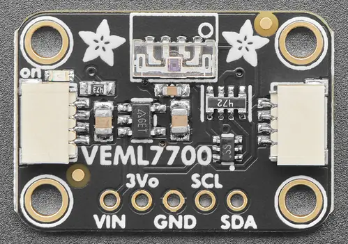

.. _adafruit_veml7700:

Adafruit VEML7700 Shield
########################

Overview
********

The `Adafruit VEML7700 Lux Sensor Shield`_ features
a `Vishay VEML7700 High Accuracy Ambient Light Sensor`_ and two STEMMA QT connectors.
It measures ambient light in the range 0 to 140000 lx. There are two versions of the
sensor; top view and side view.
Adafruit sells both versions, and this shield definition can be used with both.

   Adafruit VEML7700 shield, top view version  (Credit: Adafruit)

Requirements
************

This shield can be used with boards which provide an I2C connector, for
example STEMMA QT or Qwiic connectors.
The target board must define a ``zephyr_i2c`` node label.
See :ref:`shields` for more details.

Pin Assignments
===============

+--------------+-------------------+
| Shield Pin   | Function          |
+==============+===================+
| SDA          | VEML7700 I2C SDA  |
+--------------+-------------------+
| SCL          | VEML7700 I2C SCL  |
+--------------+-------------------+

See :dtcompatible:`vishay,veml7700` for documentation on how to adjust the
devicetree file, for example to use power saving mode.

Programming
***********

Set ``--shield adafruit_veml7700`` when you invoke ``west build``. For example
when running the :zephyr:code-sample:`light_sensor_polling` sample:

.. zephyr-app-commands::
   :zephyr-app: samples/sensor/light_polling
   :board: adafruit_qt_py_rp2040
   :shield: adafruit_veml7700
   :goals: build

.. _Adafruit VEML7700 Lux Sensor Shield:
   https://learn.adafruit.com/adafruit-veml7700

.. _Vishay VEML7700 High Accuracy Ambient Light Sensor:
   https://www.vishay.com/en/product/84286/
