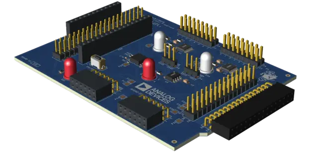

.. _adi_lsmspg:

Analog Devices Low-Speed Mixed-Signal Playground
################################################

Overview
********

The `Analog Devices Low-Speed Mixed-Signal Playground`_ features AD5592R and AD5593R ADC/DAC
devices, connected to sample small analog circuits, allowing for exploration of analog concepts.

   Analog Devices Low-Speed Mixed-Signal Playground Shield

Pin Assignments
===============

+----------------------+--------------+
| Shield Connector Pin | Function     |
+======================+==============+
| SDA                  | AD5593R SDA  |
+----------------------+--------------+
| SCL                  | AD5593R SCL  |
+----------------------+--------------+
| SCK                  | AD5592R SCK  |
+----------------------+--------------+
| MISO                 | AD5592R MISO |
+----------------------+--------------+
| MOSI                 | AD5592R MOSI |
+----------------------+--------------+
| D16                  | AD5592R CS   |
+----------------------+--------------+

Requirements
************

This shield can only be used with a board which provides a configuration for Feather connectors and
defines node aliases for SPI, I2C and GPIO interfaces (see :ref:`shields` for more details).

Programming
***********

Set ``--shield adi_lsmspg`` when you invoke ``west build``. For example:

.. zephyr-app-commands::
   :zephyr-app: tests/drivers/dac
   :board: adafruit_feather_rp2040/rp2040
   :shield: adi_lsmspg
   :goals: build

.. _Analog Devices Low-Speed Mixed-Signal Playground:
   https://www.analog.com/adalm-lsmspg
