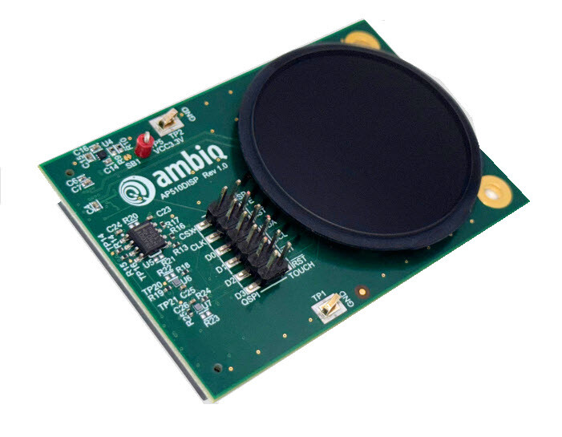
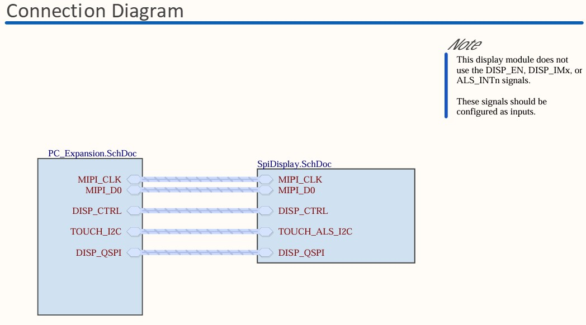

.. ap510_disp:

Ambiq Apollo510 Display Add-on Board
####################################

Overview
********

Display shield add-on board for AP510 1.4" round 454x454 AMOLED touchscreen with
MIPI-DSI/QSPI interfaces.

.. note::
   The shield ap510_disp is utilizing a CO5300 panel controller and shall specifically
   use ``ap510_disp`` as SHIELD

   Apollo510 evaluation board display card

   Apollo510 evaluation board display card Connector

Visibility header J1
+------+--------------+------------+-------+--------------+-----------------+
| J1   | Description  | Interface  | J1    | Description  | Interface       |
| odd  |              |            | even  |              |                 |
+======+==============+============+=======+==============+=================+
| 1    | CSX          | GPIO       | 2     | DISP_TE      | DSI/QSPI        |
+------+--------------+------------+-------+--------------+-----------------+
| 3    | QSPI_CLK     | QSPI       | 4     | DISP_RST     | GPIO            |
+------+--------------+------------+-------+--------------+-----------------+
| 5    | QSPI_D0      | QSPI       | 6     | TOUCH_SDA    | I2C             |
+------+--------------+------------+-------+--------------+-----------------+
| 7    | QSPI_D1      | QSPI       | 8     | TOUCH_SCL    | I2C             |
+------+--------------+------------+-------+--------------+-----------------+
| 9    | QSPI_D2      | QSPI       | 10    | TOUCH_INT    | GPIO            |
+------+--------------+------------+-------+--------------+-----------------+
| 11   | QSPI_D3      | QSPI       | 12    | TOUCH_RST    | GPIO            |
+------+--------------+------------+-------+--------------+-----------------+

Display Connector J5
+------+--------------+------------+-------+--------------+-----------------+
| J5   | Description  | Interface  | J5    | Description  | Interface       |
| odd  |              |            | even  |              |                 |
+======+==============+============+=======+==============+=================+
| 1    | TOUCH_INT    | GPIO       | 2     | TOUCH_SDA    | I2C             |
+------+--------------+------------+-------+--------------+-----------------+
| 3    | TOUCH_SCL    | I2C        | 4     | VCC3V3       | Power           |
+------+--------------+------------+-------+--------------+-----------------+
| 5    | QSPI_D3      | QSPI       | 6     | VCC3V3       | Power           |
+------+--------------+------------+-------+--------------+-----------------+
| 7    | QSPI_D2      | QSPI       | 8     | GND          | -               |
+------+--------------+------------+-------+--------------+-----------------+
| 9    | DISP_RST     | GPIO       | 10    | -            | -               |
+------+--------------+------------+-------+--------------+-----------------+
| 11   | -            | -          | 12    | VDD_5V       | Power           |
+------+--------------+------------+-------+--------------+-----------------+
| 13   | QSPI_D0      | QSPI       | 14    | QSPI_CLK     | QSPI            |
+------+--------------+------------+-------+--------------+-----------------+
| 15   | GND          | -          | 16    | CSX          | QSPI            |
+------+--------------+------------+-------+--------------+-----------------+
| 17   | GND          | -          | 18    | MIPI_D0_N    | DSI             |
+------+--------------+------------+-------+--------------+-----------------+
| 19   | MIPI_D0_P    | DSI        | 20    | GND          | -               |
+------+--------------+------------+-------+--------------+-----------------+
| 21   | MIPI_CLK_N   | DSI        | 22    | MIPI_CLK_P   | DSI             |
+------+--------------+------------+-------+--------------+-----------------+
| 23   | GND          | -          | 24    | SYS_VDD      | Power           |
+------+--------------+------------+-------+--------------+-----------------+
| 25   | DISP_TE      | DSI/QSPI   | 26    | VCC3V3       | Power           |
+------+--------------+------------+-------+--------------+-----------------+
| 27   | QSPI_D1      | QSPI       | 28    | GND          | -               |
+------+--------------+------------+-------+--------------+-----------------+
| 29   | TOUCH_RST    | GPIO       | 30    | GND          | -               |
+------+--------------+------------+-------+--------------+-----------------+

Requirements
************

Your board needs to have a ``mipi_dsi`` device tree label to work with this shield.

Usage
*****

The shield can be used in any application by setting ``SHIELD`` to
``ap510_disp`` and adding the necessary device tree properties.

Set ``--shield "ap510_disp"`` when you invoke ``west build``. For example:

.. zephyr-app-commands::
   :zephyr-app: samples/drivers/display
   :board: apollo510_evb
   :shield: ap510_disp
   :goals: build

References
**********

- `Product page <https://www.ambiq.top/en/apollo510-display-add-on-board>`_
