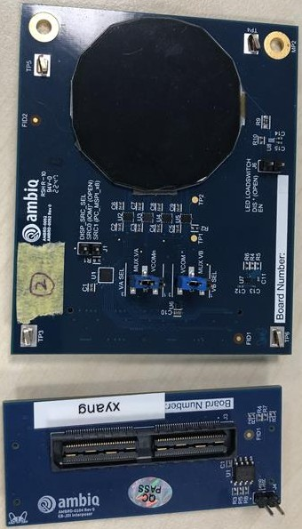
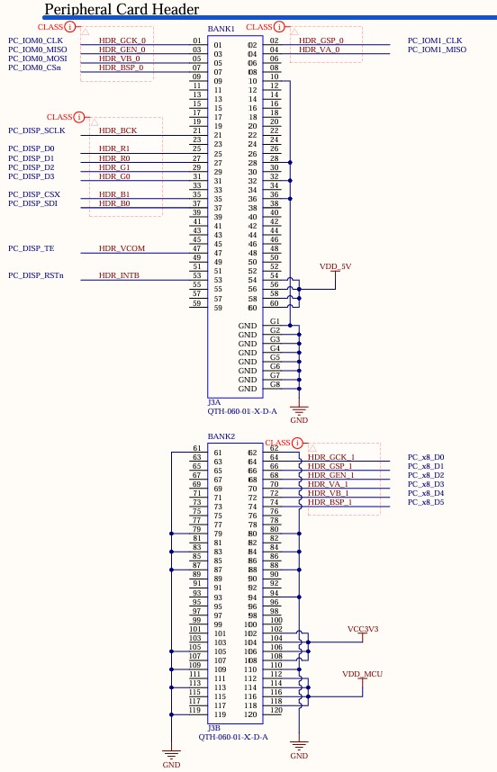

.. _ap510_jdi_disp:

Ambiq Apollo510 Display Add-on Board
####################################

Overview
********

Display shield add-on board for AP510 1.39" round 280*280 reflective active-matrix
with slightly transmissive panel of color with JDI interfaces.

.. note::
   The shield ap510_jdi_disp is utilizing a LS014B7DD01 panel controller and shall
   specifically use ``ap510_jdi_disp`` as SHIELD

   Apollo510 engineering board JDI display card

   Apollo510 engineering board JDI display card Connector

Requirements
************

Your board needs to have a ``jdi`` device tree label to work with this shield.

Usage
*****

The shield can be used in any application by setting ``SHIELD`` to
``ap510_jdi_disp`` and adding the necessary device tree properties.

Set ``--shield ap510_jdi_disp`` when you invoke ``west build``. For example:

.. zephyr-app-commands::
   :zephyr-app: samples/drivers/display
   :board: apollo510_eb
   :shield: ap510_jdi_disp
   :goals: build

References
**********

The Apollo510 Engineering Board & its components are not sold, you can contact
us to inquire about replacement boards.

- `Product page <https://support.ambiq.com/hc/en-us>`_
