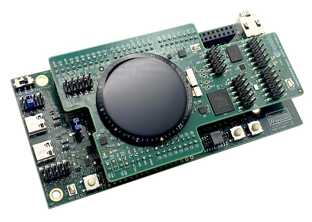

.. _apollo4p_evb_disp_shield:

Ambiq Apollo4P Display Shield
#############################

Overview
********

Apollo4 Plus display shield includes an AMOLED display with a MIPI
DSI interface. There are 2 sensors laminated into the display. Ambient
light sensor TSL2540 and TMA525C touch sensor. On the shield user
can find also PSRAM, additional flash memory, an e-MMC module
and an ADXL362 accelerometer.

Hardware
********

- 1.4” 454x454 Pixel MIPI/SPI/QSPI AMOLED display
- Display laminated ambient light sensor - TSL2540
- Display laminated capacitive touch sensor - TMA525C
- 256Mb Hex-SPI double-data-rate (DDR) enabled PSRAM - APS256XXN
- 64Mb Octal-SPI DDR enabled flash memory - IS25WX064
- 4GB x1/x4/x8 e-MMC module - THGBMNG5D1LBAIT
- 3-Axis MEMS accelerometer - ADXL362

For more information about the Apollo4 Plus and Apollo4P Display Shield:

- `Apollo4 Plus Website`_
- `Apollo4 Plus Datasheet`_
- `Apollo4P Display Shield Website`_

Requirements
************

This shield can only be used with a :ref:`apollo4p_evb` board.

.. _Apollo4 Plus Website:
   https://ambiq.com/apollo4-plus/

.. _Apollo4 Plus Datasheet:
   https://contentportal.ambiq.com/documents/20123/388415/Apollo4-Plus-SoC-Datasheet.pdf

.. _Apollo4P Display Shield Website:
   https://www.ambiq.top/en/apollo4-plus-display-kit
