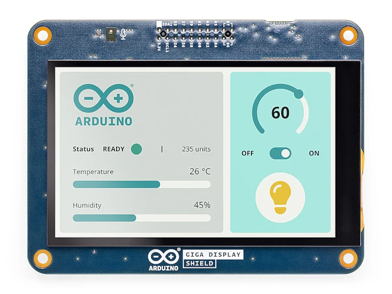

.. _arduino_giga_display_shield:

Arduino GIGA Display Shield
###########################

Overview
********

The Arduino GIGA Display Shield is an extension for the Arduino GIGA R1 WiFi board.
It provides a convenient way to add a display to your projects by offering connectors
for various display modules, including DSI and DPI interfaces.
Additionally, it exposes connectors for the camera interface and includes a microSD card slot.

The front of the shield is equipped with the KD040WVFID026-01-C025A panel, a 3.97-inch
TFT display with a resolution of 480*800 pixels. The panel also features a capacitive
multi-touch screen with a GT911 controller accessible over I2C.

The shield can be connected to the Arduino GIGA R1 WiFi board via the high-density connectors.

More information about the shield can be found at `Arduino GIGA Display Shield website`_.

     Arduino GIGA Display Shield

Requirements
************

This shield can only be used with the Arduino GIGA R1 WiFi board, which provides the
necessary connectors and interfaces for display and camera modules.
The board must define node aliases for the required peripherals (e.g., I2C, SPI, DSI)
to properly interface with the shield.

Programming
***********

Include ``--shield arduino_giga_display_shield`` when you invoke ``west build``
for projects utilizing this shield. For example:

.. zephyr-app-commands::
   :zephyr-app: samples/subsys/display/lvgl
   :board: arduino_giga_r1_wifi
   :shield: arduino_giga_display_shield
   :goals: build

References
**********

.. target-notes::

.. _Arduino GIGA Display Shield website:
   https://docs.arduino.cc/hardware/giga-display-shield/
