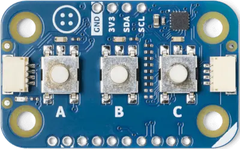

.. _arduino_modulino_buttons:

Arduino Modulino Buttons
########################

Overview
********

The Arduino Modulino Buttons is a QWIIC compatible module with three buttons
and three LEDs.

Programming
***********

Set ``--shield arduino_modulino_buttons`` when you invoke ``west build``, the
buttons will be available through the input subsystem and the LEDs through the
LED subsystem.

For example,

.. zephyr-app-commands::
   :zephyr-app: samples/subsys/input
   :board: arduino_uno_r4@wifi
   :shield: arduino_modulino_buttons
   :goals: build
