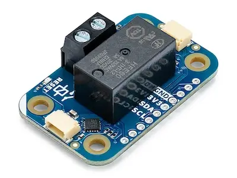

.. _arduino_modulino_latch_relay:

Arduino Modulino Latch Relay
############################

Overview
********

The Arduino Modulino Latch Relay is a QWIIC compatible module with a latch relay.

Programming
***********

Set ``--shield arduino_modulino_latch_relay`` when you invoke ``west build`` - then the
relay will be available in your application.

For example,

.. zephyr-app-commands::
   :zephyr-app: samples/regulator/regulator_shell
   :board: arduino_nano_matter
   :shield: arduino_modulino_latch_relay
   :goals: build
