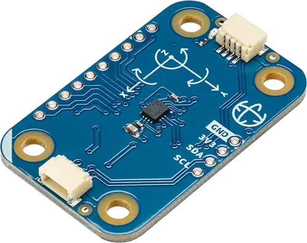

.. _arduino_modulino_movement:

Arduino Modulino Movement
#########################

Overview
********

The Arduino Modulino Movement is a QWIIC compatible module with an ST Microelectronics LSM6DSOXTR
6-axis IMU sensor.

See :dtcompatible:`st,lsm6dso` for more information on the settings available for this sensor.

Programming
***********

Set ``--shield arduino_modulino_movement`` when you invoke ``west build``.

For example,

.. zephyr-app-commands::
   :zephyr-app: samples/sensor/accel_polling
   :board: arduino_uno_r4@wifi
   :shield: arduino_modulino_movement
   :goals: build
