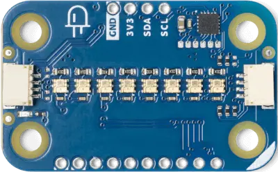

.. _arduino_modulino_smartleds:

Arduino Modulino smart LEDs
###########################

Overview
********

The Arduino Modulino smart LEDs is a QWIIC compatible module with 8 addressable
LEDs.

Programming
***********

Set ``--shield arduino_modulino_smartleds`` when you invoke ``west build``, the
leds will be available through the LED strip subsystem.

For example,

.. zephyr-app-commands::
   :zephyr-app: samples/drivers/led/led_strip
   :board: arduino_uno_r4@wifi
   :shield: arduino_modulino_smartleds
   :goals: build
