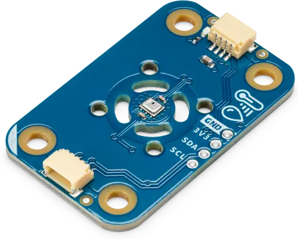

.. _arduino_modulino_thermo:

Arduino Modulino Thermo
#######################

Overview
********

The Arduino Modulino Thermo is a QWIIC compatible module built around the Renesas HS3003 temperature
and humidity sensor.

Programming
***********

Set ``--shield arduino_modulino_thermo`` when you invoke ``west build``.

For example,

.. zephyr-app-commands::
   :zephyr-app: samples/sensor/dht_polling
   :board: arduino_uno_r4@wifi
   :shield: arduino_modulino_thermo
   :goals: build
