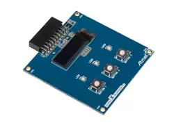

.. _atmel_oled1_xplained_pro_extension_kit:

Atmel OLED1 Xplained Pro Extension Kit
######################################

Overview
********
The Atmel OLED Xplained Pro shield provides a monochrome 128x32 OLED display
as well as three discrete indicator LEDs and three momentary pushbutton switches.
The display is controlled by an integrated SSD1306 driver chip connected via a
4-wire SPI interface operating at up to 100 MHz.

The shield attaches to an Atmel Xplained Pro evaluation board by means of a 20-pin,
100 mil female connector. The shield requires a 3.3V supply voltage. It will not
work with evaluation boards that use a different voltage.

For more details on the shield including pinouts, see the `Atmel OLED1 Xplained Pro User Guide`_.
A complete schematic can be found in the `Atmel OLED1 Xplained Pro Design Docs`_.

Requirements
************
This shield requires a Zephyr-supported Atmel evaluation board which defines the
Xplained Pro Extension Header GPIO pins (typically ``ext1_header`` and
``ext2_header``) as well as the associated SPI buses (typically ``ext1_spi`` and
``ext2_spi``). On some boards an EXT3 header is also available.

MCUs with a multi-purpose SERCOM module require a DTS overlay at the application
level to select the SPI driver, configure the pin mux, and configure the chip
select. An example of this overlay is provided for the D21 Xplained Pro in
the LVGL Basic Demo sample application; see below.

Tested Boards
=============

+-----------------------------+----------------------+-------------------+
| Board Name                  | Zephyr Designation   | Extension Headers |
+=============================+======================+===================+
| SAM D21 Xplained Pro        | atsamd21_xpro        | EXT1, EXT2, EXT3  |
+-----------------------------+----------------------+-------------------+
| SAM E70 Xplained            | sam_e70_xplained     | EXT1, EXT2        |
+-----------------------------+----------------------+-------------------+
| SAM V71 Xplained Ultra      | sam_v71_xult         | EXT1, EXT2        |
+-----------------------------+----------------------+-------------------+

Sample usage
************
The :zephyr:code-sample:`lvgl` demonstrates display operation by showing a fixed
"Hello World!" message and an incrementing counter. The counter can be reset to
zero using the SW0 User Button on the evaluation board. Instructions to build
this sample are shown in the next section.

There is no pre-built sample to demonstrate the 3 indicator LEDs and 3 pushbuttons.
However these devices can be referenced easily in code as follows:

.. code-block:: c

   static struct gpio_dt_spec leds[] =
   {
      GPIO_DT_SPEC_GET(DT_ALIAS(atmel_oled1_xpro_led1), gpios),
      GPIO_DT_SPEC_GET(DT_ALIAS(atmel_oled1_xpro_led2), gpios),
      GPIO_DT_SPEC_GET(DT_ALIAS(atmel_oled1_xpro_led3), gpios)
   };
   static struct gpio_dt_spec switches[] =
   {
      GPIO_DT_SPEC_GET(DT_ALIAS(atmel_oled1_xpro_sw1), gpios),
      GPIO_DT_SPEC_GET(DT_ALIAS(atmel_oled1_xpro_sw2), gpios),
      GPIO_DT_SPEC_GET(DT_ALIAS(atmel_oled1_xpro_sw3), gpios)
   };

Build and Programming
*********************
Set ``-DSHIELD=<shield designator>`` when you invoke ``west build``. The shield
designator is determined by the physical connector being used:

* ``atmel_oled_xpro`` for EXT1
* ``atmel_oled_xpro_ext2`` for EXT2
* ``atmel_oled_xpro_ext3`` for EXT3

Example of building the LVGL Basic Demo for a SAM V71 Ultra Xplained using the EXT1 connector:

.. zephyr-app-commands::
   :zephyr-app: samples/subsys/display/lvgl
   :host-os: unix
   :board: sam_v71_xult
   :shield: atmel_oled_xpro
   :goals: build flash
   :compact:

References
**********

.. target-notes::

.. _Atmel OLED1 Xplained Pro User Guide:
   https://ww1.microchip.com/downloads/aemDocuments/documents/OTH/ProductDocuments/UserGuides/40002176A.pdf

.. _Atmel OLED1 Xplained Pro Design Docs:
   https://ww1.microchip.com/downloads/en/DeviceDoc/OLED1-Xplained-Pro_Design-Documentation.zip
