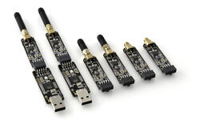
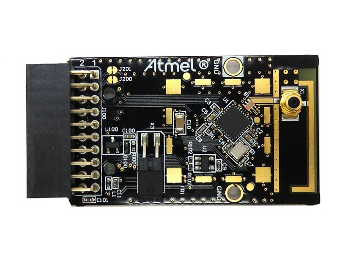

.. _atmel_at86rf2xx_transceivers:

Atmel AT86RF2XX Transceivers
############################

Overview
********

The Atmel AT86RF2xx is a high performance radio transceiver targeted for IEEE
802.15.4, ZigBee, RF4CE, 6LoWPAN, and ISM applications.  The AT86RF2xx is a
true SPI-to-antenna solution and can be operated by any external
microcontroller.

The current IEEE 802.15.4 AT86RF2xx Zephyr driver currently works with any
2.4 Ghz transceiver, except AT86RF230. The RF2xx driver allows use of
:ref:`ieee802154_interface` and :ref:`thread_protocol_interface` network
stacks.

This is a generic shield focused not only on Atmel Development Boards Kits.
There are compatible designations for `AT AVR-RZ600`_ and `AT REB233-XPRO`_.
This means, any Atmel board with 10-pin Xplained or 20-pin Xplained Pro
extension headers can be used. You can check
`Atmel Xplained Pro Hardware Development Kit User Guide`_ for more information.
Besides that, Arduino and MikroBus standard headers are available to complement
the shield module configurations.  For any other project that doesn't fit on
the current available variations an overlay can be created.  However, the
overlay is the last resource and is recommended use standard header always
possible.

RZ600 Module
============

The RZ600 Development Kit needs Atmel Xplained or Xplained-Pro header
connector.  The modules from this kit are available without any transceiver
advanced features.  For Xplained headers the `atmel_rf2xx_xplained`_ must be
selected.  For Xplained-Pro header the `atmel_rf2xx_legacy`_ must be enabled.

Pins Assignment of the RZ600 Module
===================================

+---------+--------+-------------------------------------+
|   Pin   |  Name  |           Function                  |
+=========+========+=====================================+
|    1    |  RST   | GPIO - Reset                        |
+---------+--------+-------------------------------------+
|    2    |  MISC  | DNU - Do Not Use                    |
+---------+--------+-------------------------------------+
|    3    |  IRQ   | GPIO - Interrupt                    |
+---------+--------+-------------------------------------+
|    4    | SLP_TR | GPIO - Multi purpose control signal |
+---------+--------+-------------------------------------+
|    5    |   CS   | SPI Chip Select                     |
+---------+--------+-------------------------------------+
|    6    |  MOSI  | SPI Master Out / Slave In           |
+---------+--------+-------------------------------------+
|    7    |  MISO  | SPI Master In / Slave Out           |
+---------+--------+-------------------------------------+
|    8    |  SCLK  | SPI Clock                           |
+---------+--------+-------------------------------------+
|    9    |  GND   |                                     |
+---------+--------+-------------------------------------+
|   10    |  VDD   |  POWER +3.3V                        |
+---------+--------+-------------------------------------+

REB233-XPRO Module
==================

The REB233-XPRO development kit uses Atmel Xplained Pro header.  It is enabled
selecting `atmel_rf2xx_xpro`_ option.

Pins Assignment of the REB233-XPRO Module
=========================================

+---------+--------+-------------------------------------+
|   Pin   |  Name  |           Function                  |
+=========+========+=====================================+
|    1    |   ID   | DNU - Do Not Use                    |
+---------+--------+-------------------------------------+
|    2    |  GND   |                                     |
+---------+--------+-------------------------------------+
|    3    |  DIG1  | DNU - Do Not Use                    |
+---------+--------+-------------------------------------+
|    4    |  DIG3  | DNU - Do Not Use                    |
+---------+--------+-------------------------------------+
|    5    |  DIG2  | GPIO - RX Frame Time Stamping       |
+---------+--------+-------------------------------------+
|    6    |  CLKM  | DNU - Do Not Use                    |
+---------+--------+-------------------------------------+
|    7    |  RST   | GPIO - Reset                        |
+---------+--------+-------------------------------------+
|    8    |        |                                     |
+---------+--------+-------------------------------------+
|    9    |  IRQ   | GPIO - Interrupt                    |
+---------+--------+-------------------------------------+
|   10    | SLP_TR | GPIO - Multi purpose control signal |
+---------+--------+-------------------------------------+
|   11    |  SDA   | EEPROM - AT24MAC602                 |
+---------+--------+-------------------------------------+
|   12    |  SCL   | EEPROM - AT24MAC602                 |
+---------+--------+-------------------------------------+
|   13    |        |                                     |
+---------+--------+-------------------------------------+
|   14    |        |                                     |
+---------+--------+-------------------------------------+
|   15    |   CS   | SPI Chip Select                     |
+---------+--------+-------------------------------------+
|   16    |  MOSI  | SPI Master Out / Slave In           |
+---------+--------+-------------------------------------+
|   17    |  MISO  | SPI Master In / Slave Out           |
+---------+--------+-------------------------------------+
|   18    |  SCLK  | SPI Clock                           |
+---------+--------+-------------------------------------+
|   19    |  GND   |                                     |
+---------+--------+-------------------------------------+
|   20    |  VDD   |  POWER +3.3V                        |
+---------+--------+-------------------------------------+

.. note:: DIG2 is not current implemented on RF2xx driver.

Arduino Shields
===============

Arduino Uno R3 header is available without advanced features.  It is enabled
selecting `atmel_rf2xx_arduino`_ variant option.

Pins Assignment of the Arduino Shield Modules
=============================================

+---------+--------+-------------------------------------+
|   Pin   |  Name  |           Function                  |
+=========+========+=====================================+
|   D0    |        |                                     |
+---------+--------+-------------------------------------+
|   D1    |        |                                     |
+---------+--------+-------------------------------------+
|   D2    |  IRQ   | GPIO - Interrupt                    |
+---------+--------+-------------------------------------+
|   D3    |        |                                     |
+---------+--------+-------------------------------------+
|   D4    |        |                                     |
+---------+--------+-------------------------------------+
|   D5    |        |                                     |
+---------+--------+-------------------------------------+
|   D6    |        |                                     |
+---------+--------+-------------------------------------+
|   D7    |        |                                     |
+---------+--------+-------------------------------------+
|   D8    |  RST   | GPIO - Reset                        |
+---------+--------+-------------------------------------+
|   D9    | SLP_TR | GPIO - Multi purpose control signal |
+---------+--------+-------------------------------------+
|   D10   |   CS   | SPI Chip Select                     |
+---------+--------+-------------------------------------+
|   D11   |  MOSI  | SPI Master Out / Slave In           |
+---------+--------+-------------------------------------+
|   D12   |  MISO  | SPI Master In / Slave Out           |
+---------+--------+-------------------------------------+
|   D13   |  SCLK  | SPI Clock                           |
+---------+--------+-------------------------------------+
|   D14   |        |                                     |
+---------+--------+-------------------------------------+
|   D15   |        |                                     |
+---------+--------+-------------------------------------+
|         |  GND   |                                     |
+---------+--------+-------------------------------------+
|         |  VDD   |  POWER +3.3V                        |
+---------+--------+-------------------------------------+
|         |  VCC   |  POWER +5.0V                        |
+---------+--------+-------------------------------------+

MikroBus Shields
================

MikroBus header is available without advanced features.  It is
enabled selecting `atmel_rf2xx_mikrobus`_ variant option.

Pins Assignment of the MikroBus Shield Modules
==============================================

+---------+--------+-------------------------------------+
|   Pin   |  Name  |           Function                  |
+=========+========+=====================================+
|   AN    |  RST   | GPIO - Reset                        |
+---------+--------+-------------------------------------+
|   RST   |        |                                     |
+---------+--------+-------------------------------------+
|   CS    |   CS   | SPI Chip Select                     |
+---------+--------+-------------------------------------+
|   SCK   |  SCLK  | SPI Clock                           |
+---------+--------+-------------------------------------+
|  MISO   |  MISO  | SPI Master In / Slave Out           |
+---------+--------+-------------------------------------+
|  MOSI   |  MOSI  | SPI Master Out / Slave In           |
+---------+--------+-------------------------------------+
| VCC-3.3 |  VDD   |  POWER +3.3V                        |
+---------+--------+-------------------------------------+
|   GND   |  GND   |                                     |
+---------+--------+-------------------------------------+
|   GND   |  GND   |                                     |
+---------+--------+-------------------------------------+
| VCC-5.0 |  VCC   |  POWER +5.0V                        |
+---------+--------+-------------------------------------+
|   SDA   |        |                                     |
+---------+--------+-------------------------------------+
|   SCL   |        |                                     |
+---------+--------+-------------------------------------+
|   TX    |        |                                     |
+---------+--------+-------------------------------------+
|   RX    |        |                                     |
+---------+--------+-------------------------------------+
|   INT   |  IRQ   | GPIO - Interrupt                    |
+---------+--------+-------------------------------------+
|   PWM   | SLP_TR | GPIO - Multi purpose control signal |
+---------+--------+-------------------------------------+

Supported variations
====================

The below table suggests shield variation accordingly with end user
application.  When a standard connector (arduino, mikrobus, xplained,
xplained-pro) is available on board, user should select the matching shield
configuration. When atmel_rf2xx shield is used with a board that doesn't
feature a standard connector, a dedicated <board>.overlay file should be
provided.  The remaining configurations should be used based on the board
standard headers available.

+-----------------------------+------------------------------+-----------+
| Connector Standard          | Shield Designation           | Variation |
+=============================+==============================+===========+
| Without standard (overlay)  | `atmel_rf2xx`_               |     1     |
+-----------------------------+------------------------------+-----------+
| Atmel Xplained header       | `atmel_rf2xx_xplained`_      |     2     |
+-----------------------------+------------------------------+-----------+
| Atmel Xplained Pro header   | `atmel_rf2xx_xpro`_          |     3     |
+-----------------------------+------------------------------+-----------+
| Atmel Xplained Pro header   | `atmel_rf2xx_legacy`_        |     4     |
+-----------------------------+------------------------------+-----------+
| Arduino                     | `atmel_rf2xx_arduino`_       |     5     |
+-----------------------------+------------------------------+-----------+
| MikroBus                    | `atmel_rf2xx_mikrobus`_      |     6     |
+-----------------------------+------------------------------+-----------+

Requirements
************

This shield requires a board which provides a configuration that allows an
SPI interface, an interrupt signal and two GPIO. (see :ref:`shields` for more
details).

.. note::
	Boards that already have a network interface:  Check network
	documentation to understand how properly configure both interfaces.
	To keep simple, make sure IEEE 802.15.4 is the only interface enabled
	at Networking -> Link Layer Options.  This will avoid problems running
	Zephyr samples.

Tested Boards
=============

+------------------------------+------------------------------+-----------+
| Board                        | Disabled Interface           | Variation |
+==============================+==============================+===========+
| ATMEL sam4s_xplained         |                              |     2     |
+------------------------------+------------------------------+-----------+
| ATMEL sam4e_xpro             | Ethernet                     |   3 , 4   |
+------------------------------+------------------------------+-----------+
| ATMEL sam_v71_xult/samv71q21 | Ethernet                     | 3 , 4 , 5 |
+------------------------------+------------------------------+-----------+

Sample usage
************

You can try use IEEE 802.15.4 and/or OpenThread with the Zephyr Echo server
and Echo client samples, which provide out-of-the-box configuration for
both IEEE 802.15.4 and OpenThread.  To enable IEEE 802.15.4 support in the
samples, build them with ``overlay-802154.conf`` overlay config file.  Same
way, to enable OpenThread support, build them with ``overlay-ot.conf`` overlay
config file. See :zephyr:code-sample:`sockets-echo-server` and
:zephyr:code-sample:`sockets-echo-client` samples for details.

Build and Programming
*********************

Set ``--shield <shield designator>`` when you invoke ``west build``.

.. zephyr-app-commands::
   :zephyr-app: samples/net/sockets/echo_server
   :host-os: unix
   :board: sam4s_xplained
   :gen-args: -DEXTRA_CONF_FILE=overlay-802154.conf
   :shield: atmel_rf2xx_xplained
   :goals: build flash
   :compact:

.. zephyr-app-commands::
   :zephyr-app: samples/net/sockets/echo_server
   :host-os: unix
   :board: [sam4e_xpro | sam_v71_xult/samv71q21]
   :gen-args: -DEXTRA_CONF_FILE=overlay-802154.conf
   :shield: [atmel_rf2xx_xpro | atmel_rf2xx_legacy]
   :goals: build flash
   :compact:

.. zephyr-app-commands::
   :zephyr-app: samples/net/sockets/echo_server
   :host-os: unix
   :board: [sam_v71_xult/samv71q21 | frdm_k64f | nucleo_f767zi]
   :gen-args: -DEXTRA_CONF_FILE=overlay-802154.conf
   :shield: atmel_rf2xx_arduino
   :goals: build flash
   :compact:

.. zephyr-app-commands::
   :zephyr-app: samples/net/sockets/echo_server
   :host-os: unix
   :board: lpcxpresso55s69_ns
   :gen-args: -DEXTRA_CONF_FILE=overlay-802154.conf
   :shield: atmel_rf2xx_microbus
   :goals: build flash
   :compact:

References
**********

.. target-notes::

.. _AT AVR-RZ600:
   https://www.microchip.com/DevelopmentTools/ProductDetails/PartNO/ATAVRRZ600

.. _AT REB233-XPRO:
   https://www.microchip.com/DevelopmentTools/ProductDetails/PartNO/ATREB233-XPRO

.. _Atmel Xplained Pro Hardware Development Kit User Guide:
   http://ww1.microchip.com/downloads/en/DeviceDoc/Atmel-42091-Atmel-Xplained-Pro-Hardware-Development-Kit_User%20Guide.pdf

.. _atmel_rf2xx:
   https://github.com/zephyrproject-rtos/zephyr/blob/master/boards/shields/atmel_rf2xx/atmel_rf2xx.overlay

.. _atmel_rf2xx_xplained:
   https://github.com/zephyrproject-rtos/zephyr/blob/master/boards/shields/atmel_rf2xx/atmel_rf2xx_xplained.overlay

.. _atmel_rf2xx_xpro:
   https://github.com/zephyrproject-rtos/zephyr/blob/master/boards/shields/atmel_rf2xx/atmel_rf2xx_xpro.overlay

.. _atmel_rf2xx_legacy:
   https://github.com/zephyrproject-rtos/zephyr/blob/master/boards/shields/atmel_rf2xx/atmel_rf2xx_legacy.overlay

.. _atmel_rf2xx_arduino:
   https://github.com/zephyrproject-rtos/zephyr/blob/master/boards/shields/atmel_rf2xx/atmel_rf2xx_arduino.overlay

.. _atmel_rf2xx_mikrobus:
   https://github.com/zephyrproject-rtos/zephyr/blob/master/boards/shields/atmel_rf2xx/atmel_rf2xx_mikrobus.overlay
