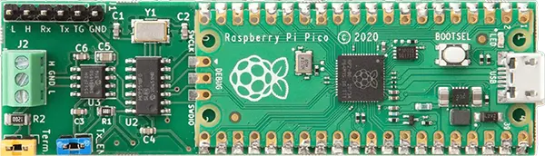

.. _canis_canpico:

Canis Labs CANPico Shield
#########################

Overview
********

The Canis Labs CANPico shield supports the Microchip MCP2517FD or MCP2518FD
stand-alone CAN controller and Microchip MCP2562FD high-speed CAN FD
transceiver. The CANPico is a carrier board in a ‘sock’ format for a
Raspberry Pi Pico family.

Hardware
********

- MCP2517/2518FD

        - External CAN FD Controller with Serial Peripheral Interface (SPI)
        - Arbitration Bit Rate up to 1 Mbps
        - Data Bit Rate up to 8 Mbps
        - CAN FD Controller modes: CAN 2.0B Mode or Mixed CAN 2.0B and CAN FD Mode
        - Conforms to ISO 11898-1:2015

- MCP2562FD

        - Optimized for CAN FD (Flexible Data rate) at 2, 5 and 8 Mbps Operation
        - Maximum Propagation Delay: 120 ns
        - Implements ISO-11898-2 and ISO-11898-5 Standard Physical Layer Requirements
        - Very Low Standby Current (5 µA, typical)
        - VIO Supply Pin to Interface Directly to CAN Controllers and Microcontrollers with 1.8V to 5.5V I/O

- Connectivity

        - Jumper header to enable a 120W CAN bus termination resistor
        - Jumper header to enable the CAN TX line to the transceiver
        - Screw terminal connector to CAN bus
        - CAN controller interrupt and Start-of-Frame inputs to GPIO pins
        - Direct access via GPIO pins to the CAN transceiver Tx and Rx pins
        - Test instrument header (for an oscilloscope or logic analyzer)

+-------+-----------------------+---------------------------+
| Name  | Function              | Usage                     |
+=======+=======================+===========================+
| GP0   | None                  |                           |
+-------+-----------------------+---------------------------+
| GP1   | None                  |                           |
+-------+-----------------------+---------------------------+
| GP2   | TRIG                  | Programmable trigger      |
+-------+-----------------------+---------------------------+
| GP3   | STBY                  | Transceiver standby       |
+-------+-----------------------+---------------------------+
| GP4   | SOF                   | Clock/SOF                 |
+-------+-----------------------+---------------------------+
| GP5   | IRQ                   | Transceiver interrupt     |
+-------+-----------------------+---------------------------+
| GP6   | None                  | SPI CS                    |
+-------+-----------------------+---------------------------+
| GP7   | None                  |                           |
+-------+-----------------------+---------------------------+
| GP8   | SPI1_Rx               | SPI Rx                    |
+-------+-----------------------+---------------------------+
| GP9   | None                  |                           |
+-------+-----------------------+---------------------------+
| GP10  | SPI1_SCK              | SPI clock                 |
+-------+-----------------------+---------------------------+
| GP11  | SPI1_Tx               | SPI Tx                    |
+-------+-----------------------+---------------------------+
| GP12  | None                  |                           |
+-------+-----------------------+---------------------------+
| GP13  | None                  |                           |
+-------+-----------------------+---------------------------+
| GP14  | None                  |                           |
+-------+-----------------------+---------------------------+
| GP15  | None                  |                           |
+-------+-----------------------+---------------------------+
| GP16  | None                  |                           |
+-------+-----------------------+---------------------------+
| GP17  | None                  |                           |
+-------+-----------------------+---------------------------+
| GP18  | None                  |                           |
+-------+-----------------------+---------------------------+
| GP19  | None                  |                           |
+-------+-----------------------+---------------------------+
| GP20  | None                  |                           |
+-------+-----------------------+---------------------------+
| GP21  | Rx                    | CAN Rx data               |
+-------+-----------------------+---------------------------+
| GP22  | Tx                    | CAN Tx data               |
+-------+-----------------------+---------------------------+
| GP23  | None                  |                           |
+-------+-----------------------+---------------------------+
| GP24  | None                  |                           |
+-------+-----------------------+---------------------------+
| GP25  | None                  |                           |
+-------+-----------------------+---------------------------+
| GP26  | None                  |                           |
+-------+-----------------------+---------------------------+
| GP27  | None                  |                           |
+-------+-----------------------+---------------------------+
| GP28  | None                  |                           |
+-------+-----------------------+---------------------------+

- Test header

        - TRIG:  Programmable trigger output
        - Tx:  Logic-level CAN Tx data
        - Rx:  Logic-level CAN Rx data
        - H:  Raw CAN-Hi signal
        - L:  Raw CAN-Low signal

- Power Supply

        - 3.3V ~ 5V

- Components

        - Tx Enable jumper
        - 120 ohm terminator jumper

For more information about the Canis Labs CANPico shield:

- `Canis Labs Website`_
- `CANPico CAN Bus Shield`_
- `MCP2517FD Datasheet`_
- `MCP2518FD Datasheet`_
- `MCP2562FD Datasheet`_

Programming
***********

Set ``--shield canis-canpico`` when you invoke ``west build`` or ``cmake``
in your Zephyr application. For example:

.. zephyr-app-commands::
   :zephyr-app: samples/drivers/can/counter
   :tool: all
   :board: rpi_pico
   :shield: canpico
   :goals: build flash

.. _Canis Labs Website:
   https://canislabs.com/

.. _CANPico CAN Bus Shield:
   https://canislabs.com/canpico/

.. _MCP2517FD:
   https://www.microchip.com/en-us/product/MCP2518FD

.. _MCP2517FD Datasheet:
   https://ww1.microchip.com/downloads/aemDocuments/documents/OTH/ProductDocuments/DataSheets/MCP2517FD-External-CAN-FD-Controller-with-SPI-Interface-20005688B.pdf

.. _MCP2518FD:
   https://www.microchip.com/en-us/product/MCP2518FD

.. _MCP2518FD Datasheet:
   https://ww1.microchip.com/downloads/aemDocuments/documents/OTH/ProductDocuments/DataSheets/External-CAN-FD-Controller-with-SPI-Interface-DS20006027B.pdf

.. _MCP2562FD Datasheet:
   https://ww1.microchip.com/downloads/aemDocuments/documents/OTH/ProductDocuments/DataSheets/20005284A.pdf
