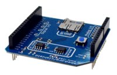

.. _ci_test_shield:

CI Test Shield: test arduino expansion board
############################################

Overview
********
The CI-Test-shield is used to verify the the peripherals in a software port of mbed-os for a new board.
External peripherals like PWM, Digital IO, I2C, SPI ...are all tested with the CI Test shield.
This board is from Minewtech.

The CI-Test-shield is compatible with the Arduino UNO R3 connector layout.
and interfaces with the host microcontroller pins.

More information about the board can be found at the
`CI-Test-shield website`_.

Hardware
********

CI-Test-shield provides:

    Digital I/O - loopback
    Analog I/O - resistor mesh
    PWM - loopback
    UART - Loopback
    Interrupt In
    loopback with Digital Out
    SPI - microSD card R/W
    I2C - EEPROM or Temp Sensor

Programming
***********

You can use the CI-Test-shield as a SD card interface or for other test purpose.
Activate the presence of the shield for the project build by adding
the ``-DSHIELD`` arg to the build command:

 .. zephyr-app-commands::
    :zephyr-app: your_app
    :board: your_board_name
    :shield: ci_shield
    :goals: build

Alternatively, set use of this shield in the project's ``CMakeLists.txt`` file:

.. code-block:: none

	set(SHIELD ci_shield)

References
**********

.. target-notes::

.. _CI-Test-shield website:
   https://os.mbed.com/components/CI-Test-Shield-Minewtech/
