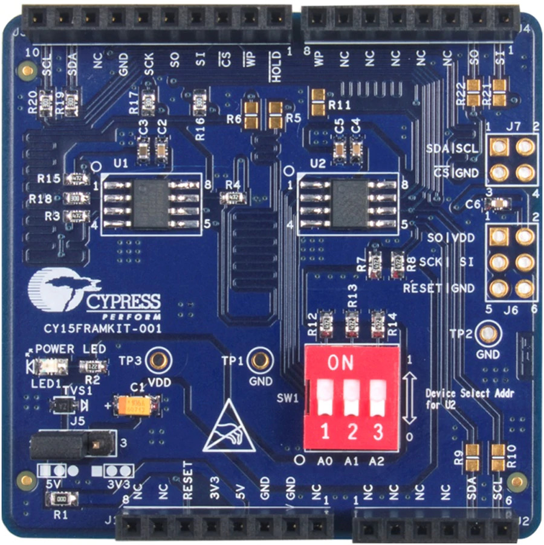

.. _cy15framkit_001:

CY15FRAMKIT-001
###############

Overview
********

Evaluation kit for Cypress' FM24W256 (I2C) and FM25W256 (SPI) F-RAM modules.

Datasheets and other related information can be found `here <https://www.cypress.com/documentation/development-kitsboards/cy15framkit-001-serial-f-ram-development-kit-guide>`_.

Requirements
************

This shield requires that the devicetree nodes ``arduino_i2c`` and
``arduino_spi`` are defined for your board. For examples have a look at
``boards/arm/nrf52840dk_nrf52840/nrf52840dk_nrf52840.dts``.

Compatibility
*************

This shield has been tested with the following boards::

  nrf52833dk_nrf52833
  nrf52840dk_nrf52840
  ubx_bmd340eval_nrf52840

Build
*****

This shield is compatible with the eeprom example located under ::

  samples/drivers/eeprom

Build with ::

  west build -b <YOUR_BOARD> <PATH_TO_EEPROM_EXAMPLE> -- -DSHIELD=cy15framkit-001
