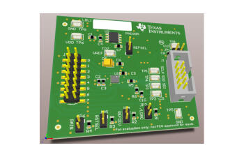
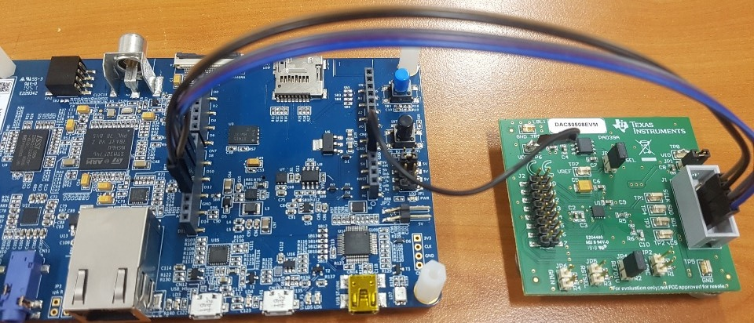

.. _dac80508_evm_shield:

DAC80508 Evaluation Module
####################################

Overview
********

The Texas Instruments DAC80508 Evaluation Module (EVM) is a
DAC development module for the TI DAC80508 series.

Requirements
************

This shield can only be used with a development board that provides a
configuration for Arduino connectors and defines a node alias for the
SPI interface (see :ref:`shields` for more details).

The SPI connector pins on the DAC80508 EVM can be connected to the
Arduino headers of the development board using jumper wires.
In addition, 5V must be connected to the DAC80508 EVM's TP6(VDD).

For more information about interfacing the DAC80508 series and the
DACx0508 EVM in particular, see these TI documents:

- `DACx0508 Evaluation Module User's Guide`_
- `DAC80508 True 16-bit, 8-channel, SPI`_

.. _DACx0508 Evaluation Module User's Guide:
   https://www.ti.com/lit/pdf/slau734

.. _DAC80508 True 16-bit, 8-channel, SPI:
   https://www.ti.com/product/DAC80508
