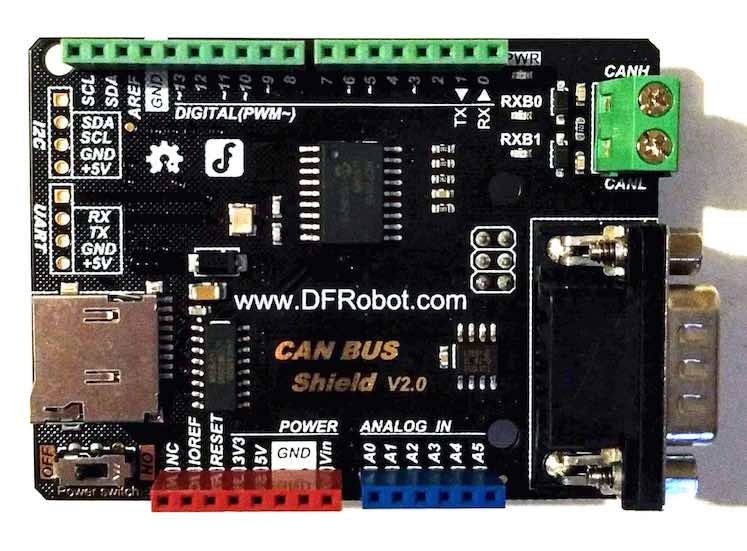

.. _dfrobot_can_bus_v2_0:

DFRobot CAN BUS Shield V2.0
###########################

Overview
********

The DFRobot CAN BUS shield supports the Microship MCP2515 stand-alone CAN
controller and JTA1050 high speed CAN transceiver.
The shield has an Arduino Uno R3 compatible hardware interface.

Hardware
********

- MCP2515

        - Stand-Alone CAN 2.0B Controller
        - Up to 1Mb/s baud rate
        - Standard and extended data and remote frames
        - 3x Tx Buffers
        - 2x Rx Buffers
        - 6x 29-bit Filters
        - 2x 29-bit Masks
        - Interrupt output
        - One shot mode
        - High speed SPI interface (10 MHz)

- TJA1050

        - Fully compatible with the “ISO 11898” standard
        - High speed (up to 1 Mbaud)

- Connectivity

        - Industrial standard DB9 terminal (CAN)
        - Screw terminals (CAN)
        - Integrated MicroSD socket for data storage (SPI)
        - Arduino Uno R3 compatible (SPI)

+-------+-----------------------+---------------------------+
| Name  | Function              | Usage                     |
+=======+=======================+===========================+
| A0    | None                  |                           |
+-------+-----------------------+---------------------------+
| A1    | None                  |                           |
+-------+-----------------------+---------------------------+
| A2    | None                  |                           |
+-------+-----------------------+---------------------------+
| A3    | None                  |                           |
+-------+-----------------------+---------------------------+
| A4    | None                  |                           |
+-------+-----------------------+---------------------------+
| A5    | None                  |                           |
+-------+-----------------------+---------------------------+
| D0    | RX                    | Ext. header only          |
+-------+-----------------------+---------------------------+
| D1    | TX                    | Ext. header only          |
+-------+-----------------------+---------------------------+
| D2    | GPIO_INT_ACTIVE_LOW   | MCP2515 - INT             |
+-------+-----------------------+---------------------------+
| D3    | None                  |                           |
+-------+-----------------------+---------------------------+
| D4    | SPI-CS                | MicroSD                   |
+-------+-----------------------+---------------------------+
| D5    | None                  |                           |
+-------+-----------------------+---------------------------+
| D6    | None                  |                           |
+-------+-----------------------+---------------------------+
| D7    | None                  |                           |
+-------+-----------------------+---------------------------+
| D8    | None                  |                           |
+-------+-----------------------+---------------------------+
| D9    | None                  |                           |
+-------+-----------------------+---------------------------+
| D10   | SPI-CS                | MCP2515                   |
+-------+-----------------------+---------------------------+
| D11   | SPI-MOSI              | MCP2515 / MicroSD         |
+-------+-----------------------+---------------------------+
| D12   | SPI-MISO              | MCP2515 / MicroSD         |
+-------+-----------------------+---------------------------+
| D13   | SPI-CLK               | MCP2515 / MicroSD         |
+-------+-----------------------+---------------------------+
| D14   | I2C-SDA               | Ext. header only          |
+-------+-----------------------+---------------------------+
| D15   | I2C_SCL               | Ext. header only          |
+-------+-----------------------+---------------------------+

- Power Supply

        - 3.3V ~ 5V

- Components

        - Power switch
        - Power LED
        - RX0BF LED
        - RX1BF LED

For more information about the DFRobot CAN-BUS V2.0 shield:

- `DFRobot Website`_
- `DFRobot CAN BUS Shield V2.0 schematic`_
- `MCP2515 Datasheet`_
- `TJA1050 Datasheet`_

Programming
***********

Set ``-DSHIELD=dfrobot_can_bus_v2_0`` when you invoke ``west build`` or ``cmake`` in your
Zephyr application. For example:

.. zephyr-app-commands::
   :zephyr-app: samples/drivers/CAN
   :tool: all
   :board: nrf52_pca10040
   :shield: dfrobot_can_bus_v2_0
   :conf: prj.mcp2515.conf
   :goals: build flash

.. _DFRobot Website:
   https://www.dfrobot.com/product-1444.html

.. _DFRobot CAN BUS Shield V2.0 schematic:
   https://github.com/DFRobot/CAN_BUS/blob/master/DFR0370%20CAN%20BUS%20sheild(V2.0).pdf

.. _MCP2515 Datasheet:
   http://ww1.microchip.com/downloads/en/DeviceDoc/MCP2515-Stand-Alone-CAN-Controller-with-SPI-20001801J.pdf

.. _TJA1050 Datasheet:
   https://www.nxp.com/docs/en/data-sheet/TJA1050.pdf
