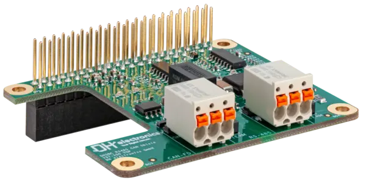

.. _dhsbc_rs485_can_shield:

DH electronics DHSBC RS485 CAN Shield
=====================================

Overview
********

The DHSBC RS485 CAN Shield is an expansion board that is compatible with the
DHSBC STM32MP25. The shield can be easily connected to the respective
single-board computer via the 40-pin expansion header without any additional
effort. The board provides one RS485 interface (up to 500 kbp/s) and one CAN FD
interface (up to 5 Mbit/s), which are routed to the outside via a picoMAX
connector.

See `DHSBC RS485 CAN Shield home page`_ and
`DHSBC RS485 CAN Shield user manual`_ for more information.

   DHSBC RS485 CAN Shield

The RS485 part of the shield is modeled as a Modbus RTU serial backend
using the ``zephyr,modbus-serial`` compatible. Driver direction control is
connected to Raspberry Pi header signals.

- ``GPIO17 (pin 5)`` as ``DE`` (driver enable)
- ``GPIO16 (pin 24)`` as ``RE`` (receiver enable, active low)

There is no dedicated CAN controller on the shield; it uses the integrated CAN
controller on the SoC directly. The shield only has a CAN transceiver.

- ``GPIO23 (pin 9)`` as ``CAN-TX``
- ``GPIO24 (pin 10)`` as ``CAN-RX``

Requirements
************

For the RS485 part, this shield requires a board that provides Raspberry Pi
header aliases for:

- ``raspberrypi_serial``
- ``raspberrypi_header``

For the CAN part, the CAN lines are not specified by the Raspberry Pi connector.
Therefore CAN transceiver nodes must be provided by each board-specific overlay,
see:
:zephyr_file:`boards/shields/dhsbc_rs485_can_shield/boards/stm32mp255c_dhsbc_stm32mp255cxx_m33.overlay`

Socket selection is controlled by the board DTS aliases. See :ref:`shields`
for more details.

Programming
***********

Set the shield to ``dhsbc_rs485_can_shield`` when invoking ``west build``.

Example CAN
-----------

.. zephyr-app-commands::
   :zephyr-app: samples/drivers/can/babbling
   :board: stm32mp255c_dhsbc/stm32mp255cxx/m33
   :shield: dhsbc_rs485_can_shield
   :goals: build

Example RS-485
--------------

The Modbus RTU server sample expects three LEDs but this shield does not have
any. But the shield routes all Raspberry Pi pins to the outside so that LEDs can
be connected to pin headers. The shield overlay defines LEDs on:

- ``GPIO26 (pin 25)`` as ``LD1``
- ``GPIO20 (pin 26)`` as ``LD2``
- ``GPIO21 (pin 27)`` as ``LD3``

The Modbus RTU server sample expects Arduino header in its ``app.overlay``.
Therefore the ``app.overlay`` must be excluded from the build.
This is done by setting the ``DTC_OVERLAY_FILE`` to an empty string.

.. zephyr-app-commands::
   :zephyr-app: samples/subsys/modbus/rtu_server
   :board: stm32mp255c_dhsbc/stm32mp255cxx/m33
   :shield: dhsbc_rs485_can_shield
   :gen-args: -DDTC_OVERLAY_FILE=
   :goals: build

**********

References
==========

.. target-notes::

.. _DHSBC RS485 CAN Shield home page: https://www.dh-electronics.com/en/embedded-products/development-carrier-boards/detail/dhsbc-rs-485-can-shield
.. _DHSBC RS485 CAN Shield user manual: https://www.dh-electronics.com/en/download/file/downloads/USM_DHSBC-RS485-CAN-Shield.pdf
