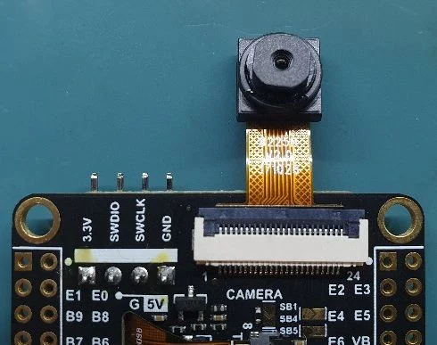

.. _dvp_24pin_ov2640:

DVP 24-pin OV2640 Camera Modules
################################

Overview
********

This shield supports the OV2640 camera modules with an 24-pin FFC connector compatible with the
de-facto standard for camera modules described here: :dtcompatible:`dvp-24pin-connector`

+-------------------+--------------+
| FFC Connector Pin | Function     |
+===================+==============+
| 1                 | NC           |
+-------------------+--------------+
| 2                 | Analog GND   |
+-------------------+--------------+
| 3                 | SDA          |
+-------------------+--------------+
| 4                 | Analog VDD   |
+-------------------+--------------+
| 5                 | SCL          |
+-------------------+--------------+
| 6                 | Reset        |
+-------------------+--------------+
| 7                 | Vsync        |
+-------------------+--------------+
| 8                 | Powerdown    |
+-------------------+--------------+
| 9                 | Hsync        |
+-------------------+--------------+
| 10                | Digital VDD  |
+-------------------+--------------+
| 11                | I/O VDD      |
+-------------------+--------------+
| 12                | Data 8       |
+-------------------+--------------+
| 13                | Master Clock |
+-------------------+--------------+
| 14                | Data 7       |
+-------------------+--------------+
| 15                | Data GND     |
+-------------------+--------------+
| 16                | Data 6       |
+-------------------+--------------+
| 17                | Pixel Clock  |
+-------------------+--------------+
| 18                | Data 5       |
+-------------------+--------------+
| 19                | Data 1       |
+-------------------+--------------+
| 20                | Data 4       |
+-------------------+--------------+
| 21                | Data 2       |
+-------------------+--------------+
| 22                | Data 3       |
+-------------------+--------------+
| 23                | NC           |
+-------------------+--------------+
| 24                | NC           |
+-------------------+--------------+

Requirements
************

See :dtcompatible:`dvp-24pin-connector`

Programming
***********

Set ``--shield dvp_24pin_ov2640`` when you invoke ``west build``. For example:

.. zephyr-app-commands::
   :zephyr-app: samples/subsys/video/capture
   :board: aipi_eyes_s2
   :shield: dvp_24pin_ov2640
   :goals: build

References
**********

.. target-notes::

.. _Camera OV2640:
   https://blog.arducam.com/ov2640/

.. _OV2640 datasheet:
   https://www.uctronics.com/download/cam_module/OV2640DS.pdf
