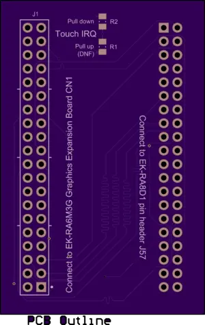
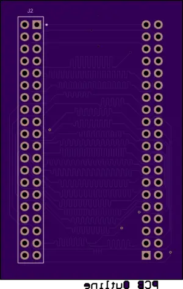

.. _ek_ra8d1_rtk7eka6m3b00001bu:

EK-RA8D1 to RTK7EKA6M3B00001BU Display Adapter
##############################################

Overview
********

The EK-RA8D1 to RTK7EKA6M3B00001BU Display Adapter is an open-source hardware converter PCB that
adapts the EK-RA8D1 Parallel Graphics Expansion Port (J57) to the RTK7EKA6M3B00001BU display
shield.

   EK-RA8D1 to RTK7EKA6M3B00001BU Display Adapter (top)

   EK-RA8D1 to RTK7EKA6M3B00001BU Display Adapter (bottom)

Programming
***********

Set ``--shield ek_ra8d1_rtk7eka6m3b00001bu`` when you invoke ``west build``.
This shield is just a converter, so it is usually used with RTK7EKA6M3B00001BU shield.

For example,

.. zephyr-app-commands::
   :zephyr-app: tests/drivers/display/display_read_write
   :board: ek_ra8d1
   :shield: ek_ra8d1_rtk7eka6m3b00001bu,rtk7eka6m3b00001bu
   :goals: build

References
**********
- `EK-RA8D1 to RTK7EKA6M3B00001BU Display Adapter`_

.. _EK-RA8D1 to RTK7EKA6M3B00001BU Display Adapter:
   https://oshpark.com/shared_projects/pzfp0mCD
