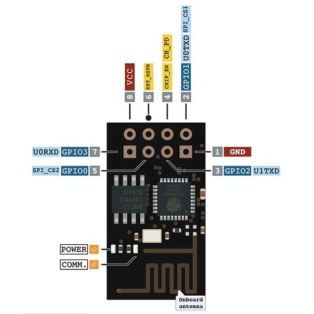

.. _module_esp_8266:

ESP-8266 Modules
################

Overview
********

ESP-8266 radio is a cost-effective Wi-Fi SOC module which allows any
microcontrollers to easily access to WiFi network. This module supports
the standard IEEE802.11 b/g/n protocol, built-in complete TCP/IP protocol
stack. Users can use this series of modules to add networking capabilities
to existing devices.

The simplest module that uses ESP-8266 is ESP-01. This is a generic shield
configuration that allows any ESP-8266 module variation including ESP-12E/F.

Pins Assignment of the ESP-01 Module
====================================

+---------------+-------------------------------------+
| Connector Pin | Function                            |
+===============+=====================================+
| GND           | POWER GND                           |
+---------------+-------------------------------------+
| GPIO1         | U0_TXD                              |
+---------------+-------------------------------------+
| GPIO2         |                                     |
+---------------+-------------------------------------+
| CHIP_EN       | ENABLE (VDD = RUN, GND = LOW POWER) |
+---------------+-------------------------------------+
| GPIO0         |                                     |
+---------------+-------------------------------------+
| EXT_RST       |                                     |
+---------------+-------------------------------------+
| GPIO3         | U0_RXD                              |
+---------------+-------------------------------------+
| VDD           | POWER +3.3V                         |
+---------------+-------------------------------------+

Requirements
************

This shield requires a board which provides a configuration that allows an
UART interface. (see :ref:`shields` for more details).

.. note::
   Sometimes boards declare standard headers like Arduino R3 but not define
   all connections.  Make sure that the board you are using have all
   definitions to avoid build errors.

The ESP-8266 should be loaded with the `ESP8266 AT Bin`_ software which is
available at Espressif Systems web site. The ESP-01 module have up to 1MB of
flash and the last available stack that fits on this device is ESP8266 AT Bin
V1.6.2. This version is command compatible with ESP8266 AT Bin 1.7.x which is
the minimal version supported by the ESP WIFI driver.

The ESP-8266 Modules that have 2MB or more is highly recommended upgrade to
version 1.7.x for better future compatibility.

This tutorial won't explain how firmware must be upgraded. However, it will
present some tips to easily success. The ESP WIFI was tested with an ESP-01
with 1MB flash using Boot Mode and with Flash size 8Mbit: 512KB + 512KB. The
ESP8266 AT Bin 1.7.x available requires the following partition configuration
to works:

.. image:: esp_at_173.jpg
   :align: center
   :alt: ESP8266 AT Bin V1.7.3

- Tips

        - Don't forget to erase Flash before upgrade
        - Upgrade all binaries at same time.
        - ESP-8266 bootloader won't send garbage. Try connect at 74880 bps if
          you module have 26MHz crystal to detect boot fails.

.. note::
	Boards that already have a network interface:  Check network
	documentation to understand how properly configure both interfaces.
	To keep simple, make sure WiFi is the only interface enabled at
	Networking -> Link Layer Options.  This will avoid problems running
	Zephyr samples.

Supported variations
====================

The below table suggests shield variation accordingly with end user
application.  When a standard connector (arduino, mikrobus) is available on
board, user should select the matching shield configuration. When esp_8266
shield is used with a board that doesn't feature a standard connector, a
dedicated <board>.overlay file should be provided.  The remaining
configurations should be used based on the board standard headers available.

+-----------------------------+------------------------------+-----------+
| Connector Standard          | Shield Designation           | Variation |
+=============================+==============================+===========+
| Without standard (overlay)  | `esp_8266`_                  |     1     |
+-----------------------------+------------------------------+-----------+
| Arduino                     | `esp_8266_arduino`_          |     2     |
+-----------------------------+------------------------------+-----------+
| MikroBus                    | `esp_8266_mikrobus`_         |     3     |
+-----------------------------+------------------------------+-----------+

Build and Programming
*********************

Set ``--shield <shield designation>`` when you invoke ``west build``.

To build shield with specific overlay:

.. zephyr-app-commands::
   :zephyr-app: samples/net/wifi
   :board: sam4e_xpro
   :shield: esp_8266
   :goals: build flash

To build shield with standard headers:

.. zephyr-app-commands::
   :zephyr-app: samples/net/wifi
   :board: [disco_l475_iot1 | frdm_k64f | lpcxpresso55s69_ns | nucleo_f767zi]
   :shield: [esp_8266_arduino | esp_8266_mikrobus]
   :goals: build flash

References
**********

.. target-notes::

.. _ESP8266 AT Bin:
   https://www.espressif.com/en/support/download/at

.. _esp_8266:
   https://github.com/zephyrproject-rtos/zephyr/blob/master/boards/shields/esp_8266/esp_8266.overlay

.. _esp_8266_arduino:
   https://github.com/zephyrproject-rtos/zephyr/blob/master/boards/shields/esp_8266/esp_8266_arduino.overlay

.. _esp_8266_mikrobus:
   https://github.com/zephyrproject-rtos/zephyr/blob/master/boards/shields/esp_8266/esp_8266_mikrobus.overlay
