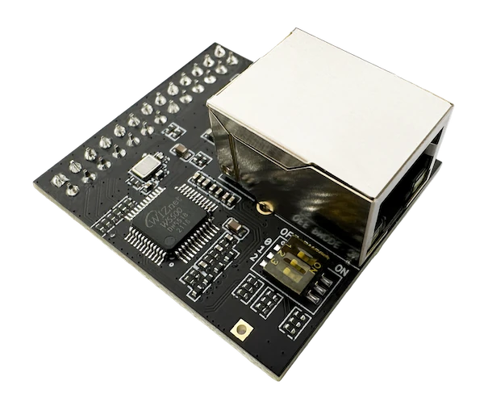

.. _esp_threadbr_ethernet:

ESP Thread BR / Zigbee GW Ethernet
##################################

Overview
********

ESP Thread Border Router / Zigbee Gateway Ethernet shield is an extension board
for the ESP Thread Border Router board. It is using the SPI bus to access the
`W5500`_ stand alone Ethernet 10/100 MBPS controller with on-board MAC & PHY,
16 KiloBytes for FIFO buffer and SPI serial interface.

Pins Assignment of the ETH Shield
===================================

+-----------------------+---------------------------------------------+
| Shield Connector Pin  | Function                                    |
+=======================+=============================================+
| RST#                  | Ethernet Controller's Reset                 |
+-----------------------+---------------------------------------------+
| CS#                   | SPI's Chip Select                           |
+-----------------------+---------------------------------------------+
| SCK                   | SPI's ClocK                                 |
+-----------------------+---------------------------------------------+
| SDO                   | SPI's target Data Output  (MISO)            |
+-----------------------+---------------------------------------------+
| SDI                   | SPI's target Data Input   (MOSI)            |
+-----------------------+---------------------------------------------+
| INT                   | Ethernet Controller's Interrupt Output      |
+-----------------------+---------------------------------------------+

Requirements
************

This shield/breakout board can be used with ESP Thread BR / Zigbee GW board.

Programming
***********

Set ``--shield esp_threadbr_ethernet`` when you invoke ``west build``.
For example:

.. zephyr-app-commands::
   :zephyr-app: samples/net/dhcpv4_client
   :board: esp_threadbr/esp32s3/procpu
   :shield: esp_threadbr_ethernet
   :goals: build

References
**********

.. target-notes::

.. _W5500:
   https://wiznet.io/products/iethernet-chips/w5500
