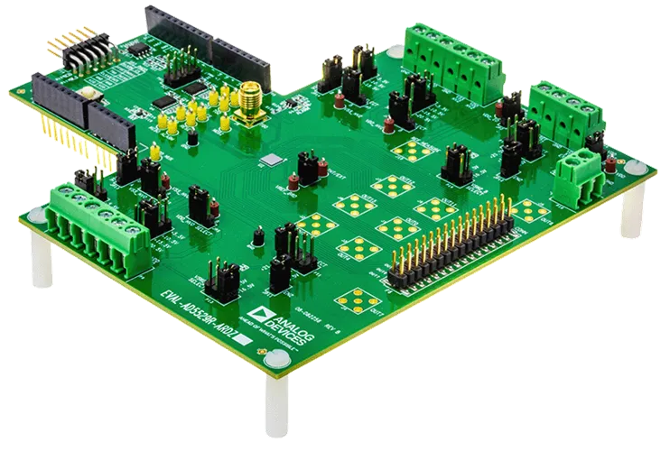

.. _eval_ad5529r_ardz:

EVAL-AD5529R-ARDZ
#################

Overview
********

The EVAL-AD5529R-ARDZ is an evaluation board for the Analog Devices AD5529R,
a 16-channel, 16-bit, high-voltage output DAC. The board features an on-board
power solution, optional precision reference (ADR4540), and connects to a host
board through Arduino R3 headers using SPI.

Programming
***********

Set ``--shield eval_ad5529r_ardz`` when you invoke ``west build``. For example:

.. zephyr-app-commands::
   :zephyr-app: samples/drivers/dac
   :board: nucleo_f401re
   :shield: eval_ad5529r_ardz
   :goals: build

Requirements
************

This shield can only be used with a board which provides a configuration for
Arduino connectors and defines node aliases for SPI and GPIO interfaces (see
:ref:`shields` for more details).

Pin Assignments
===============

+--------------+---------------------------------------------+
| Arduino Pin  | Function                                    |
+==============+=============================================+
| D7           | AD5529R CLEAR (active low)                  |
+--------------+---------------------------------------------+
| D8           | AD5529R RESET (active low)                  |
+--------------+---------------------------------------------+
| D9           | AD5529R LDAC/TG0 (active low)               |
+--------------+---------------------------------------------+
| D10          | SPI chip select (directly mapped to CS0)    |
+--------------+---------------------------------------------+
| D11          | SPI MOSI                                    |
+--------------+---------------------------------------------+
| D12          | SPI MISO                                    |
+--------------+---------------------------------------------+
| D13          | SPI SCLK                                    |
+--------------+---------------------------------------------+

References
**********

- `EVAL-AD5529R-ARDZ product page`_
- `AD5529R product page`_
- `AD5529R data sheet`_

.. _EVAL-AD5529R-ARDZ product page:
   https://www.analog.com/en/resources/evaluation-hardware-and-software/evaluation-boards-kits/eval-ad5529r.html

.. _AD5529R product page:
   https://www.analog.com/en/products/ad5529r.html

.. _AD5529R data sheet:
   https://www.analog.com/media/en/technical-documentation/data-sheets/ad5529r.pdf
