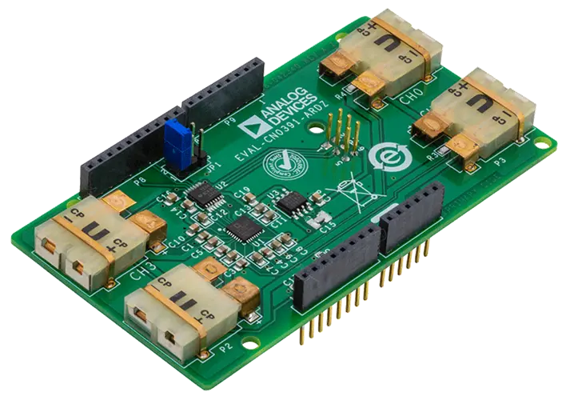

.. _eval_cn0391_ardz:

EVAL-CN0391-ARDZ
################

Overview
********

The EVAL-CN0391-ARDZ is a 4-channel thermocouple Arduino shield powered by the
Analog Devices AD7124-8 multichannel, 24-bit, sigma-delta ADC.

Programming
***********

Set ``--shield eval_cn0391_ardz`` when you invoke ``west build``. For example:

.. zephyr-app-commands::
   :zephyr-app: samples/drivers/adc/adc_dt
   :board: apard32690/max32690/m4
   :shield: eval_cn0391_ardz
   :goals: build

Requirements
************

This shield can only be used with a board which provides a configuration for
Arduino connectors and defines a node alias for a SPI interface (see
:ref:`shields` for more details).

References
**********

- `EVAL-CN0391-ARDZ product page`_
- `EVAL-CN0391-ARDZ user guide`_
- `EVAL-CN0391-ARDZ schematic`_
- `AD7124-8 product page`_
- `AD7124-8 data sheet`_

.. _EVAL-CN0391-ARDZ product page:
   https://www.analog.com/en/resources/reference-designs/circuits-from-the-lab/CN0391.html

.. _EVAL-CN0391-ARDZ user guide:
   https://wiki.analog.com/resources/eval/user-guides/eval-adicup360/hardware/cn0391

.. _EVAL-CN0391-ARDZ schematic:
   https://wiki.analog.com/_media/resources/eval/user-guides/eval-adicup360/hardware/cn0391/02-042340-01-a-1.pdf

.. _AD7124-8 product page:
   https://www.analog.com/en/products/ad7124-8.html

.. _AD7124-8 data sheet:
   https://www.analog.com/media/en/technical-documentation/data-sheets/ad7124-8.pdf
