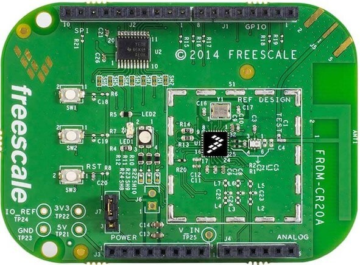

.. _frdm_cr20a_shield:

NXP FRDM-CR20A
##############

Overview
********

The Freedom development board platform supports the MCR20A 2.4GHZ wireless
transceiver. The FRDM-CR20A evaluation board is a small, low-power,
cost-effective reference design for the MCR20A transceiver in a shield form
factor, compatible with existing Freedom development platforms, such as
:zephyr:board:`frdm_k64f`.

Hardware
********

- MCR20AVHM

        - Low-power
        - High-performance 2.4 GHz IEEE 802.15.4 compliant transceiver

- Connectivity

        - PCB inverted F-type antenna and SMA RF port
        - Arduino compatible

- Power Management

        - Programmable output power -32 dBm to +8 dBm at the SMA connector, no trap
        - Receiver sensitivity: –102 dBm, typical

- Components

        - Minimum number of matching components and external balun
        - 1 RGB LED indicator
        - 2 pushbutton switches

For more information about the MCR20A SoC and FRDM-CR20A board:

- `MCR20A Website`_
- `MCR20A Datasheet`_
- `MCR20A Reference Manual`_
- `FRDM-CR20A Website`_
- `FRDM-CR20A User Guide`_
- `FRDM-CR20A Schematics`_

Programming
***********

Set ``--shield frdm_cr20a`` when you invoke ``west build``. For example:

.. zephyr-app-commands::
   :zephyr-app: samples/net/wpan_serial
   :board: frdm_k64f
   :shield: frdm_cr20a
   :goals: build

.. include:: ../../../nxp/common/board-footer.rst
   :start-after: nxp-board-footer

.. _FRDM-CR20A Website:
   https://www.nxp.com/support/developer-resources/evaluation-and-development-boards/freedom-development-boards/wireless-connectivy/freedom-development-board-for-mcr20a-wireless-transceiver:FRDM-CR20A

.. _FRDM-CR20A User Guide:
   https://www.nxp.com/docs/en/user-guide/FRDMCR20AUG.pdf

.. _FRDM-CR20A Schematics:
   https://www.nxp.com/downloads/en/schematics/FRDM-CR20A-SCH.pdf

.. _MCR20A Website:
   https://www.nxp.com/products/wireless/thread/2.4-ghz-802.15.4-wireless-transceiver:MCR20A

.. _MCR20A Datasheet:
   https://www.nxp.com/docs/en/data-sheet/MCR20AVHM.pdf

.. _MCR20A Reference Manual:
   https://www.nxp.com/docs/en/reference-manual/MCR20RM.pdf
