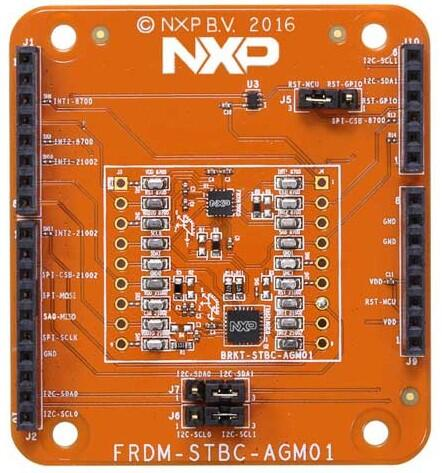

.. _frdm_stbc_agm01_shield:

NXP FRDM-STBC-AGM01
###################

Overview
********

The FRDM-STBC-AGM01 is an NXP Freedom development board with
FXOS8700 and FXAS21002. This 9-axis solution (FXAS21002C Gyroscope,
+ FXOS8700CQ E-compass sensor) is compatible with any board that
provides an Arduino R3 header.

Pin Assignment of the FRDM-STBC-AGM01 Shield
============================================

+-----------------------+---------------------+
| Shield Connector Pin  | Function            |
+=======================+=====================+
| A5                    | I2C - SCL1          |
+-----------------------+---------------------+
| A4                    | I2C - SDA1          |
+-----------------------+---------------------+
| D15                   | I2C - SCL0          |
+-----------------------+---------------------+
| D14                   | I2C - SDA0          |
+-----------------------+---------------------+
| D2                    | INT1 - 8700         |
+-----------------------+---------------------+
| D4                    | INT2 - 8700         |
+-----------------------+---------------------+
| D5                    | INT1 - 21002        |
+-----------------------+---------------------+
| D8                    | INT2 - 21002        |
+-----------------------+---------------------+
| A3                    | RST - GPIO          |
+-----------------------+---------------------+

For more information about the FXOS8700, FXAS21002, and FRDM-STBC-AGM01
board:

- :zephyr:code-sample:`fxas21002`
- `FXOS8700 Website`_
- `FRDM-STBC-AGM01 Website`_
- `FRDM-STBC-AGM01 Quick Reference Card`_
- `FRDM-STBC-AGM01 Schematics`_

Programming
***********

Set ``--shield frdm_stbc_agm01`` when you invoke ``west build``. For example:

.. zephyr-app-commands::
   :zephyr-app: samples/sensor/fxas21002
   :board: frdm_k22f
   :shield: frdm_stbc_agm01
   :goals: build

.. include:: ../../../nxp/common/board-footer.rst
   :start-after: nxp-board-footer

.. _FRDM-STBC-AGM01 Website:
   https://www.nxp.com/design/development-boards/freedom-development-boards/sensors/sensor-toolbox-development-boards-for-a-9-axis-solution-using-fxas21002c-and-fxos8700cq:FRDM-STBC-AGM01

.. _FRDM-STBC-AGM01 Quick Reference Card:
   https://www.nxp.com/docs/en/supporting-information/FRDM-STBC-AGM01-QRC.pdf

.. _FRDM-STBC-AGM01 Schematics:
   https://www.nxp.com/downloads/en/schematics/FRDM-STBC-AGM01-SCH.pdf

.. _FXOS8700 Website:
   https://www.nxp.com/products/sensors/accelerometers/digital-motion-sensor-3d-accelerometer-2g-4g-8g-plus-3d-magnetometer:FXOS8700CQ
