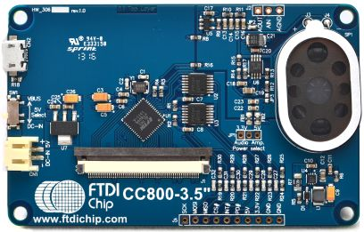

FTDI VM800C Embedded Video Engine Board
#######################################

Overview
********

The VM800C is a development module for FTDI’s FT800, which is used to develop
and demonstrate the functionality of the FT800 Embedded Video Engine, EVE. This
module behaves as an SPI slave, and requires a SPI Master for proper
microcontroller interfacing and system integration.

Pins Assignment of the Arduino Shield Modules
=============================================

+---------+--------+-------------------------------------+
|   Pin   |  Name  |           Function                  |
+=========+========+=====================================+
|   D0    |        |                                     |
+---------+--------+-------------------------------------+
|   D1    |        |                                     |
+---------+--------+-------------------------------------+
|   D2    |  INT#  | GPIO - Interrupt                    |
+---------+--------+-------------------------------------+
|   D3    |        |                                     |
+---------+--------+-------------------------------------+
|   D4    |        |                                     |
+---------+--------+-------------------------------------+
|   D5    |        |                                     |
+---------+--------+-------------------------------------+
|   D6    |        |                                     |
+---------+--------+-------------------------------------+
|   D7    |        |                                     |
+---------+--------+-------------------------------------+
|   D8    |        |                                     |
+---------+--------+-------------------------------------+
|   D9    |        |                                     |
+---------+--------+-------------------------------------+
|   D10   |  CS#   | SPI Chip Select                     |
+---------+--------+-------------------------------------+
|   D11   |  MOSI  | SPI Master Out / Slave In           |
+---------+--------+-------------------------------------+
|   D12   |  MISO  | SPI Master In / Slave Out           |
+---------+--------+-------------------------------------+
|   D13   |  SCLK  | SPI Clock                           |
+---------+--------+-------------------------------------+
|   D14   |        |                                     |
+---------+--------+-------------------------------------+
|   D15   |        |                                     |
+---------+--------+-------------------------------------+
|         |  GND   |                                     |
+---------+--------+-------------------------------------+
|         |  3.3V  |  POWER +3.3V                        |
+---------+--------+-------------------------------------+
|         |  5V    |  POWER +5.0V or +3.3V               |
+---------+--------+-------------------------------------+

Requirements
************

This shield requires a board which provides a configuration that allows an
SPI interface and an interrupt signal. (see :ref:`shields` for more
details).

Sample usage
************

You can try use FT800 with the Zephyr FT800 sample, which provides
out-of-the-box configuration for FT800 Embedded Video engine.
See :zephyr:code-sample:`ft800` sample for details.

Build and Programming
*********************

Set ``-DSHIELD=<shield designator>`` when you invoke ``west build``.

.. zephyr-app-commands::
   :zephyr-app: samples/drivers/misc/ft800
   :host-os: unix
   :board: nrf52840dk/nrf52840
   :shield: ftdi_vm800c
   :goals: build flash
   :compact:

References
**********

.. target-notes::

.. _FTDI VM800C:
   https://www.ftdichip.com/Products/Modules/VM800C.html
