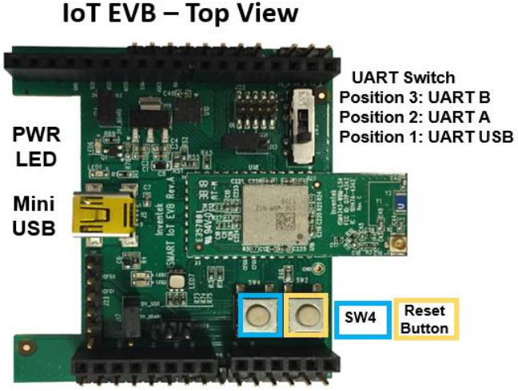
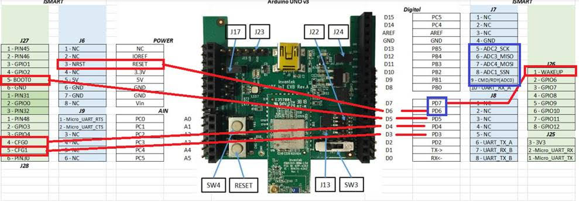

.. _inventek_eswifi_shield:

Inventek es-WIFI Shield
#######################

Overview
********

The es-WIFI (embedded Serial-to-WiFi) modules are devices developed by Inventek
Systems.  It integrates WIFI and optionally Bluetooth Low Energy.  The es-WIFI
devices can run Cypress WICED or Inventek's IWIN (Inventek Systems Wireless
Interoperability Network) AT commands set.  The current es-WIFI driver is able
to use one of two serial interfaces: SPI or UART.

The Zephyr es-WIFI drivers was implemented using ISM43362-M3G-L44 with SPI
interface.  The UART was implemented with ISM4343-WBM-L151.  Besides that,
user can reprogram the modules to switch from one interface type to another
by the JTAG pin header.

ISMART4343C-EVB
===============

The `ISMART4343C-EVB`_ is a development Kit with Arduino Uno R3 compatible
shield.  It allows evaluate es-WIFI modules with SPI or UART interface.  For
UART interface the `inventek_eswifi_arduino_uart`_ must be selected.  For
SPI interface the `inventek_eswifi_arduino_spi`_ must be enabled.  The EVB
can use 5V from Arduino header, if board provide it, J17 position 1-2.
Otherwise, J17 2-3 will select USB-5V. More information can be found at
`ISMART4343C-EVB Users Manual`_.

.. note::
	The Inventek's EVBs signals are 3.3V only.

Pins Assignment of the ISMART EVBs
==================================

The below table presents signals by interface.  The UART switch SW3 must be on
position 3 to enable RX/TX signals when using es-WIFI with UART firmware.

To enable full control by Arduino header user should do some manual wiring.
The signals from D3 up to D7 are not connected by default on the Inventek's
shield.  These signals marked as optional can help on development. The current
driver do not handle that signals and are simple suggestions and can be left
as is.  Some arduino boards don't have NRST pin connected to a GPIO pin.  The
recommendation is bend the NRST pin and make a wire to D6.  WAKE-UP signal is
available at header J26 pin 1 and shield configuration uses D7 to control that
signal, user need do a wire connecting these two terminals.  On the below
image is possible see suggested wiring connections.

+-----------------------+-----------+---------------------+
| Arduino Connector Pin | Function  | Serial Connection   |
+=======================+===========+=====================+
| D0                    | UART RX   | UART                |
+-----------------------+-----------+---------------------+
| D1                    | UART TX   | UART                |
+-----------------------+-----------+---------------------+
| D3                    | CFG-1     | UART/SPI [optional] |
+-----------------------+-----------+---------------------+
| D4                    | CFG-0     | UART/SPI [optional] |
+-----------------------+-----------+---------------------+
| D5                    | BOOT-0    | UART/SPI [optional] |
+-----------------------+-----------+---------------------+
| D6                    | NRST      | UART/SPI [wiring]   |
+-----------------------+-----------+---------------------+
| D7                    | WAKE-UP   | UART/SPI [wiring]   |
+-----------------------+-----------+---------------------+
| D9                    | CMD/RDY   | SPI                 |
+-----------------------+-----------+---------------------+
| D10                   | SPI CS    | SPI                 |
+-----------------------+-----------+---------------------+
| D11                   | SPI MOSI  | SPI                 |
+-----------------------+-----------+---------------------+
| D12                   | SPI MISO  | SPI                 |
+-----------------------+-----------+---------------------+
| D13                   | SPI SCK   | SPI                 |
+-----------------------+-----------+---------------------+

Supported variations
====================

The below table suggests shield variation accordingly with end user
application.  When a standard Arduino R3 connector is available on board, user
should select the matching shield configuration based on the serial interface
(SERIAL or SPI).  The inventek_eswifi is available to allow users testing a
built-in module with dedicated <board>.overlay and <board>.defconfig files.

+-----------------------------+---------------------------------+-----------+
| Connector Standard          | Shield Designation              | Variation |
+=============================+=================================+===========+
| Without standard (overlay)  | `inventek_eswifi`_              |     1     |
+-----------------------------+---------------------------------+-----------+
| Arduino by UART             | `inventek_eswifi_arduino_uart`_ |     2     |
+-----------------------------+---------------------------------+-----------+
| Arduino by SPI              | `inventek_eswifi_arduino_spi`_  |     3     |
+-----------------------------+---------------------------------+-----------+

Requirements
************

This shield requires a board which provides a configuration that allows an
UART or SPI interface and two or three GPIO. (see :ref:`shields` for more
details).

.. note::
	Some boards may already have a network interface:  Check network
	documentation to understand how properly configure both interfaces.
	To keep simple, you can keep only the WIFI interface enabled at
	Networking -> Link Layer Options.  This will avoid problems running
	Zephyr samples.

Tested Boards
=============

+-----------------------------+------------------------------+-----------+
| Board                       | Disabled Interface           | Variation |
+=============================+==============================+===========+
| ATMEL sam_v71_xult          | Ethernet                     |   2 , 3   |
+-----------------------------+------------------------------+-----------+
| ST nucleo_f767zi            | Ethernet                     |   2 , 3   |
+-----------------------------+------------------------------+-----------+
| ST disco_l475_iot1          |                              |     -     |
+-----------------------------+------------------------------+-----------+

.. note::
	ST disco_l475_iot1 already have an ISM43362 module with IWIN SPI
	firmware.  It doesn't need this shield to expose es-WIFI.  It is only
	used here as reference to demonstrate how configure an on-board
	module.

Sample usage
************

The reference sample for WIFI is :ref:`wifi_sample`.  It allows you use WIFI
shell to scan local Wireless networks.  With the password you can pick,
connect and send ping.

Build and Programming
*********************

Set ``-DSHIELD=<shield designator>`` when you invoke ``west build``.

.. zephyr-app-commands::
   :zephyr-app: samples/net/wifi
   :host-os: unix
   :board: [sam_v71_xult | nucleo_f767zi]
   :shield: inventek_eswifi_arduino_uart
   :goals: build flash
   :compact:

.. zephyr-app-commands::
   :zephyr-app: samples/net/wifi
   :host-os: unix
   :board: [sam_v71_xult | nucleo_f767zi]
   :shield: inventek_eswifi_arduino_spi
   :goals: build flash
   :compact:

.. zephyr-app-commands::
   :zephyr-app: samples/net/wifi
   :host-os: unix
   :board: disco_l475_iot1
   :goals: build flash
   :compact:

References
**********

.. target-notes::

.. _ISMART4343C-EVB:
   https://www.inventeksys.com/ismart4343-c-arduino-shield-wi-fi-2ghz-bluetooth-ble/

.. _ISMART4343C-EVB Users Manual:
   https://www.inventeksys.com/wp-content/uploads/IoT-EVB-Users-Manual.pdf

.. _inventek_eswifi:
   https://github.com/zephyrproject-rtos/zephyr/blob/master/boards/shields/inventek_eswifi/inventek_eswifi.overlay

.. _inventek_eswifi_arduino_uart:
   https://github.com/zephyrproject-rtos/zephyr/blob/master/boards/shields/inventek_eswifi/inventek_eswifi_arduino_uart.overlay

.. _inventek_eswifi_arduino_spi:
   https://github.com/zephyrproject-rtos/zephyr/blob/master/boards/shields/inventek_eswifi/inventek_eswifi_arduino_spi.overlay
