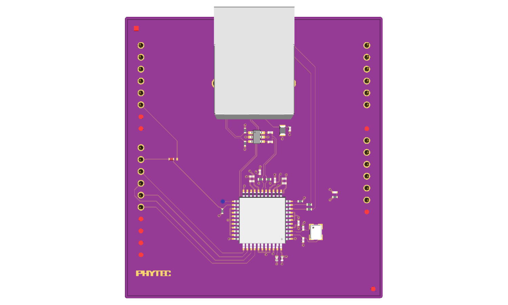

.. _link_board_eth_shield:

PHYTEC link board ETH
#####################

Overview
********

The link board ETH is an ethernet expansion board based on ENC424J600
ethernet controller and compatible with the Arduino UNO R3 connector.
It was developed as an expansion component for the reel board.
See :ref:`reel_board` documentation for more information about
link board family and how to connect it to the reel board.

Hardware
********

- ENC424J600

        - 10/100 Base-T/TX Ethernet Controller with SPI Interface
        - Factory Pre-programmed Unique MAC Address

- Connectivity

        - Arduino compatible
        - RJ45 Connector

- Electrical Characteristics

        - Supply Voltage 3.3 V
        - Supply Current 75 mA ... 147 mA

Pins Assignment of the Shield Connector
=======================================

ENC424J600 device offers a choice between an SPI based interface and
parallel slave port (PSP) interface. SPI interface is automatically selected
during startup and it requires no intervention from the MCU side.

+-----------------------+-----------------------+-----------------------------+
| Shield Connector Pin  | Function              | ENC424J600 Pin              |
+=======================+=======================+=============================+
| D0                    | not connected         |                             |
+-----------------------+-----------------------+-----------------------------+
| D1                    | not connected         |                             |
+-----------------------+-----------------------+-----------------------------+
| D2                    | not connected         |                             |
+-----------------------+-----------------------+-----------------------------+
| D3                    | not connected         |                             |
+-----------------------+-----------------------+-----------------------------+
| D4                    | not connected         |                             |
+-----------------------+-----------------------+-----------------------------+
| D5                    | alternative INTn      |                             |
+-----------------------+-----------------------+-----------------------------+
| D6                    | not populated         |                             |
+-----------------------+-----------------------+-----------------------------+
| D7                    | not populated         |                             |
+-----------------------+-----------------------+-----------------------------+
| D8                    | not connected         |                             |
+-----------------------+-----------------------+-----------------------------+
| D9                    | INTn                  | 24 (Interrupt Output)       |
+-----------------------+-----------------------+-----------------------------+
| D10                   | SPI CSn               | 34 (SPI Chip Select)        |
+-----------------------+-----------------------+-----------------------------+
| D11                   | SPI MOSI              | 36 (SPI Serial Data Input)  |
+-----------------------+-----------------------+-----------------------------+
| D12                   | SPI MISO              | 35 (SPI Serial Data Out)    |
+-----------------------+-----------------------+-----------------------------+
| D13                   | SPI SCK               | 37 (SPI Serial Clock Input) |
+-----------------------+-----------------------+-----------------------------+
| D14                   | not populated         |                             |
+-----------------------+-----------------------+-----------------------------+
| D15                   | not populated         |                             |
+-----------------------+-----------------------+-----------------------------+

+-----------------------+-----------------------+-----------------------------+
| Shield Connector Pin  | Function              | ENC424J600 Pin              |
+=======================+=======================+=============================+
| A0                    | not connected         |                             |
+-----------------------+-----------------------+-----------------------------+
| A1                    | not connected         |                             |
+-----------------------+-----------------------+-----------------------------+
| A2                    | not connected         |                             |
+-----------------------+-----------------------+-----------------------------+
| A3                    | not connected         |                             |
+-----------------------+-----------------------+-----------------------------+
| A4                    | not connected         |                             |
+-----------------------+-----------------------+-----------------------------+
| A5                    | not connected         |                             |
+-----------------------+-----------------------+-----------------------------+

For more information about the link board ETH and ENC424J600:

- `link board ETH Website`_
- `ENC424J600 Website`_

Programming
***********

Set ``-DSHIELD=link_board_eth`` when you invoke ``west build`` or ``cmake`` in your
Zephyr application. For example:

.. zephyr-app-commands::
   :zephyr-app: samples/net/zperf
   :tool: all
   :board: reel_board
   :shield: link_board_eth
   :goals: build

.. _link board ETH Website:
   https://www.phytec.eu/product-eu/internet-of-things/link-board-eth

.. _ENC424J600 Website:
   https://www.microchip.com/wwwproducts/en/ENC424J600
