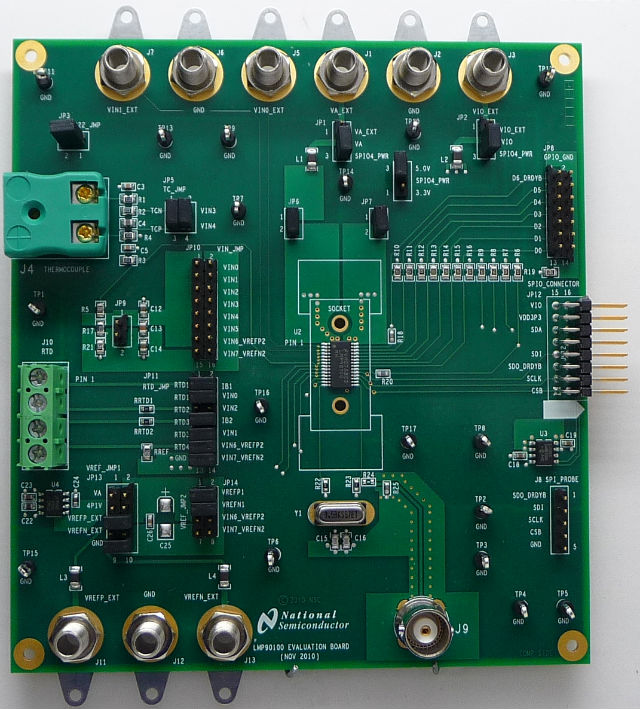

.. _lmp90100_evb_shield:

LMP90100 Sensor AFE Evaluation Board
####################################

Overview
********

The Texas Instruments LMP90100 Sensor AFE Evaluation Board (EVB) is a
development kit for the TI LMP90xxx series of analog sensor frontends.

   LMP90100 EVB (Credit: Texas Instruments)

Requirements
************

This shield can only be used with a development board that provides a
configuration for Arduino connectors and defines a node alias for the
SPI interface (see :ref:`shields` for more details).

The SPIO connector pins on the LMP90100 EVB can be connected to the
Arduino headers of the development board using jumper wires.

For more information about interfacing the LMP90xxx series and the
LMP90100 EVB in particular, see these TI documents:

- `LMP90100 Sensor AFE Evaluation Board User's Guide`_
- `LMP90100 Multi-Channel, Low Power 24-Bit Sensor AFE`_

Samples
*******

Zephyr RTOS includes one sample targeting the LMP90100 EVB:

* :ref:`lmp90100_evb_rtd_sample`

Programming
***********

Set ``--shield lmp90100_evb`` when you invoke ``west build``. For example:

.. zephyr-app-commands::
   :zephyr-app: samples/shields/lmp90100_evb/rtd
   :board: frdm_k64f
   :shield: lmp90100_evb
   :goals: build

.. _LMP90100 Sensor AFE Evaluation Board User's Guide:
   https://www.farnell.com/datasheets/1604987.pdf

.. _LMP90100 Multi-Channel, Low Power 24-Bit Sensor AFE:
   http://www.ti.com/product/LMP90100
