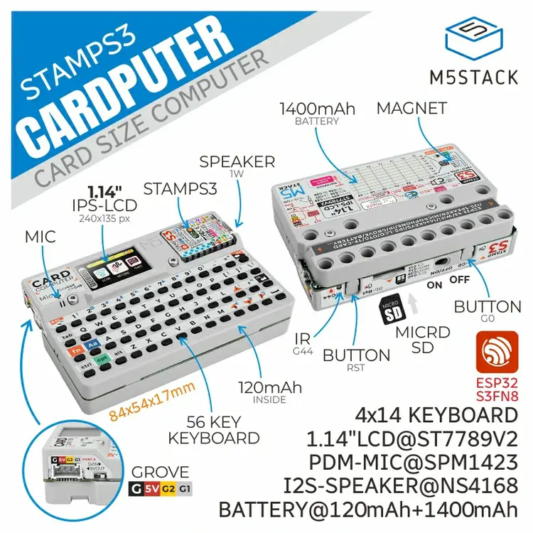

.. _m5stack_cardputer:

M5Stack-Cardputer base shield
#############################

Overview
********

`M5Stack-Cardputer`_ is a card-sized portable computer that is perfect for engineers.
At the heart of Cardputer is the M5StampS3, a mini development board based on the ESP32-S3
chip.

The 56-key keyboard and 1.14" TFT screen allow users to easily enter and view
information. The on-board SPM1423 digital MEMS microphone and built-in speaker
enable voice operations such as recording, wake-up and audio playback. The
infrared emitter allows infrared control interaction with external devices such
as TVs or air conditioners. And Cardputer offers a HY2.0-4P interface for
expanding I2C sensors such as temperature and humidity sensors, light sensors
and pressure sensors. It also includes a Micro SD card slot for expanding storage.

The device is powered by an internal 120mAh+1400mAh (in the base) lithium
battery solution.

        M5Stack-Cardputer

.. note::
   The NS4186 I2S Codec, SPM1423 microphone, IR LED and Keyboard functionality is not implemented yet.

Pins Assignments
================

+-------------------+---------------+
| ESP32-S3 GPIO Pin | Function      |
+===================+======+========+
| 0                 | User Button   |
+-------------------+---------------+
| 1                 | I2C SCL       |
+-------------------+---------------+
| 2                 | I2C SDA       |
+-------------------+---------------+
| 10                | VBAT Voltage  |
+-------------------+---------------+
| 33                | LCD RST       |
+-------------------+---------------+
| 34                | LCD RS/DC     |
+-------------------+---------------+
| 35                | LCD MOSI      |
+-------------------+---------------+
| 36                | LCD SCLK      |
+-------------------+---------------+
| 37                | LCD CS        |
+-------------------+---------------+
| 38                | LCD Backlight |
+-------------------+---------------+
| 39                | uSD MISO      |
+-------------------+---------------+
| 40                | uSD SCLK      |
+-------------------+---------------+
| 12                | uSD CS        |
+-------------------+---------------+
| 14                | uSD MOSI      |
+-------------------+---------------+

Programming
***********

Set ``--shield m5stack_cardputer`` when you invoke ``west build``.
For example:

.. zephyr-app-commands::
   :zephyr-app: samples/drivers/display
   :board: m5stack_stamps3/esp32s3/procpu
   :shield: m5stack_cardputer
   :goals: build

References
**********

.. target-notes::

.. _M5Stack-Cardputer:
   https://docs.m5stack.com/en/core/Cardputer
