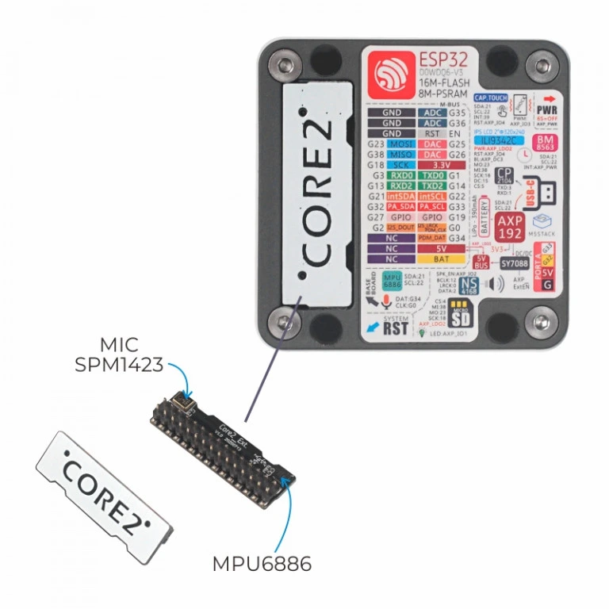

.. _m5stack_core2_ext:

M5Stack-Core2 base shield
####################################

Overview
********

`M5Stack-Core2`_ comes with a base shield that is connected to the M5Stack
extension connector. It features an MPU6886 6-axis motion tracker (6DOF IMU)
and a SPM1423 microphone.

        M5Stack-Core2-Extension module

.. note::
   The SPM1423 microphone functionality is not implemented yet.

Pins Assignments
================

+----------------------+--------------+
| Shield Connector Pin | Function     |
+======================+==============+
| 0                    | GND          |
+----------------------+--------------+
| 11                   | 3.3V         |
+----------------------+--------------+
| 16                   | I2C - intSDA |
+----------------------+--------------+
| 17                   | I2C - intSCL |
+----------------------+--------------+

Programming
***********

Set ``-DSHIELD=m5stack_core2_ext`` when you invoke ``west build``.
For example:

.. zephyr-app-commands::
   :zephyr-app: samples/sensor/mpu6050
   :board: m5stack_core2/esp32/procpu
   :shield: m5stack_core2_ext
   :goals: build

References
**********

.. target-notes::

.. _M5Stack-Core2:
   https://docs.m5stack.com/en/core/core2
