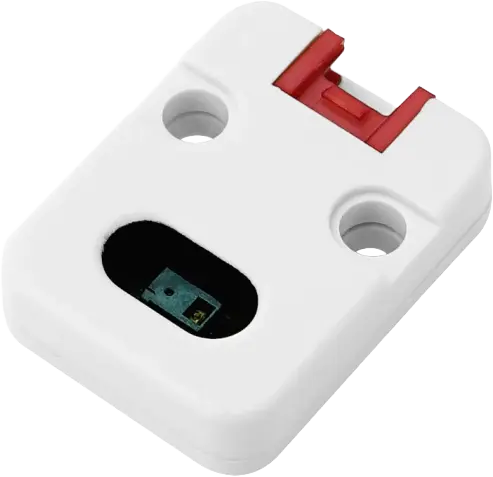

.. _m5stack_unit_gesture_shield:

M5Stack Unit Gesture
####################

Overview
********

`M5Stack Unit Gesture`_ is a compact module with the PixArt PAJ7620U2 gesture sensor. It connects
over I2C via a Grove-compatible 4-pin cable (HY2.0-4P).

   M5Stack Unit Gesture

Requirements
************

This shield can be used with a board that exposes a 4-pin I2C connector labeled ``zephyr_i2c`` in
Devicetree (see :ref:`shields`).

The PAJ7620 interrupt line is not routed to the Grove connector on this unit, so interrupt-driven
trigger modes cannot be used.

Pin assignments
===============

+--------------+-------------------+
| Grove pin    | Function          |
+==============+===================+
| 1            | I2C SCL           |
+--------------+-------------------+
| 2            | I2C SDA           |
+--------------+-------------------+
| 3            | VCC (module I/O)  |
+--------------+-------------------+
| 4            | GND               |
+--------------+-------------------+

Programming
***********

Set ``-DSHIELD=m5stack_unit_gesture`` when you invoke ``west build``. For example, using the
:zephyr:code-sample:`paj7620_gesture` sample in polling mode:

.. zephyr-app-commands::
   :zephyr-app: samples/sensor/paj7620_gesture
   :board: m5stack_core2/esp32/procpu
   :shield: m5stack_unit_gesture
   :goals: build

References
**********

.. _M5Stack Unit Gesture: https://docs.m5stack.com/en/unit/gesture
