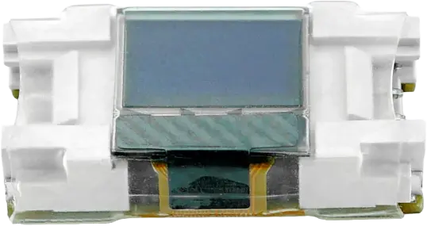

.. _m5stack_unit_minioled_shield:

M5Stack Unit Mini OLED
######################

Overview
********

`M5Stack Unit Mini OLED`_ is a 0.42-inch monochrome white OLED module with a 72x40 resolution,
and an SSD1315 controller.

   M5Stack Unit Mini OLED (Credit: M5Stack)

Requirements
************

This shield expects a board that defines ``zephyr_i2c`` (see :ref:`shield-interfaces`) for the Grove
connector to which it is connected.

Pin assignments
===============

+-----------+-------------+
| Grove pin | Function    |
+===========+=============+
| 1         | I2C SCL     |
+-----------+-------------+
| 2         | I2C SDA     |
+-----------+-------------+
| 3         | VCC (3.3 V) |
+-----------+-------------+
| 4         | GND         |
+-----------+-------------+

Programming
***********

Set ``--shield m5stack_unit_minioled`` when you invoke ``west build``. For example, using the
display LVGL sample:

.. zephyr-app-commands::
   :zephyr-app: samples/subsys/display/lvgl
   :board: m5stack_atoms3/esp32s3/procpu
   :shield: m5stack_unit_minioled
   :goals: build

References
**********

.. target-notes::

.. _`M5Stack Unit Mini OLED`: https://docs.m5stack.com/en/unit/MiniOLED%20Unit
