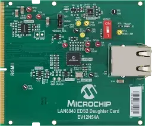

.. _mcph_lan8840_esd2_dc:

MCHP LAN8840 EDS2 Daughter Card
###############################

Overview
********

The EV12N54A LAN8840 EDS2 PHY Daughter Card enables copper Gigabit Ethernet
connectivity for Microchip development platforms with the EDS2 interface. The
LAN8840 is a completely integrated 10/100/1000 Ethernet physical layer
transceiver with PTP Support for transmission and reception of data on standard
CAT-5 as well as CAT-5e and CAT-6 unshielded twisted pair (UTP) cables. The
LAN8840 provides reduced RGMII for direct connection to switches,
microcontrollers, microprocessesers and FPGAs with an integrated Gigabit MAC in
Gigabit Ethernet processors and switches for data transfer at 10/100/1000 Mbps.
This board is intended to function as a daughter card only, which may be bundled
with some systems and can be purchased individually to meet the application
needs.

Programming
***********

Set ``--shield mcph_lan8840_eds2_dc`` when you invoke ``west build``.

For example:

.. zephyr-app-commands::
   :zephyr-app: samples/net/dhcpv4_client
   :board: sama7d65_curiosity/sama7d65
   :shield: mcph_lan8840_eds2_dc
   :goals: build

References
**********

- `LAN8840 EDS2 Daughter Card product page`_
- `LAN8840 Daughter Card User's Guide`_
- `LAN8840 product page`_
- `LAN8840 data sheet`_

.. _LAN8840 EDS2 Daughter Card product page:
   https://www.microchip.com/en-us/development-tool/ev12n54a

.. _LAN8840 Daughter Card User's Guide:
   https://ww1.microchip.com/downloads/aemDocuments/documents/UNG/
   ProductDocuments/UserGuides/LAN8840-Daughter-Card-Users-Guide-DS50003709.pdf

.. _LAN8840 product page:
   https://www.microchip.com/en-us/product/lan8840

.. _LAN8840 data sheet:
   https://ww1.microchip.com/downloads/aemDocuments/documents/UNG/
   ProductDocuments/DataSheets/LAN8840-Data-Sheet-DS00004727.pdf
