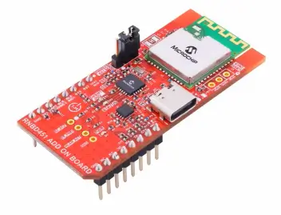
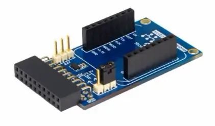
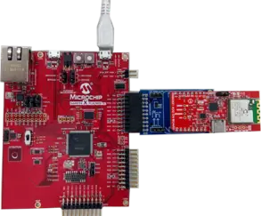

.. _rnbd451_add_on_shield:

RNBD451 Add-on Board
###############################

Overview
********

The RNBD451 Add-on Board is an efficient low-cost development platform to evaluate and demonstrate
the features, capabilities and interfaces of our Bluetooth® Low Energy module, RNBD451PE.
The add-on board is compliant to the mikroBUS™ standard and includes an on-board MCP2200 USB-to-UART
converter enabling out-of-box evaluation with no other hardware requirements.

   **Figure 1: RNBD451 Add-on Board**

Requirements
************

This shield is compatible with a development board that includes a mikroBUS™ socket.
If a mikroBUS socket is not available, a mikroBUS adapter can be used to provide both an
extension header and a mikroBUS interface. The mikroBUS™ Xplained Pro is an extension Board
for the Xplained Pro evaluation platform,  designed to support mikroBUS™ Click boards™ with
Xplained Pro MCU boards.

   **Figure 2: ATMBUSADAPTER-XPRO - mikroBUS Adapter**

Environment setup
*****************

Refer to "`Getting Started Guide
<https://docs.zephyrproject.org/latest/develop/getting_started/index.html>`_"
in "`Developing with Zephyr
<https://docs.zephyrproject.org/latest/develop/index.html>`_"
for installation instructions.
After successful installation, the Zephyr SDK environment should be fully set up.
All the sample applications listed here can be found in ``zephyrproject/zephyr/samples/bluetooth``,
assuming the Zephyr SDK document is followed and the west workspace is named as "zephyrproject".

.. note::

  When bringing up the RNBD451 Bluetooth Low Energy (BLE) controller after a Power-On Reset (POR),
  the Zephyr Bluetooth subsystem sends the **HCI reset command** (the first HCI command) to the BLE
  controller. However, in the original design, this command is sent too early for the RNBD451, as
  it takes approximately 4xx ms from POR to be ready to accept the first HCI command.

  To address this timing issue, introduce a delay in the Zephyr application to enable Bluetooth.
  This delay ensures that the **HCI reset command** is sent at the appropriate time. Add the following
  code snippet to the application to introduce a 500 ms delay before calling ``bt_enable()``:

  ``k_sleep(K_MSEC(500));``

  Additionally, to prevent a voltage drop on the **extension header VCC pin**—which may cause the
  RNBD451 to undergo a hardware reset after power-on; set **J100** to the **“BYPASS”** position. For more
  information, refer to the `SAM E54 Xplained Pro Design Documentation (New Red PCB)`_.

Hardware setting
****************

Using the SAM E54 Xplained Pro as an example, follow these steps to setup the hardware.

#. Connect SAM E54 Xplained Pro Standard Extension Header (EXT1) with the mikroBUS Xplained Pro.
#. Connect the RNBD451 to the mikroBUS Xplained Pro.
#. Set the PWR_SEL jumper on the RNBD451 to Mikro 3V3 (to use power supplied by mikroBUS).
#. Connect a USB cable to the Debug USB port.

   **Figure 3: RNBD451 Connected to ATMBUSADAPTER-XPRO and Mounted on SAM E54 Extension Header**

.. note::

   When using a different Extension Header on the SAM E54 Xplained Pro, update the
   ``rnbd451.overlay`` file accordingly.
   For more details, refer to the  `SAM E54 Xplained Pro
   User Guide`_.

For more information about interfacing with the ATMBUSADAPTER-XPRO mikroBUS adapter,
refer to the `RNBD451 Add-on Board Primary User Guide`_

Sample application project configuration (prj.conf)
***************************************************

To select the HCI Host mode and the H4 driver, while disabling  the built-in controller,
add the following configurations::

   CONFIG_BT_HCI=y
   CONFIG_BT_H4=y

To disable Bluetooth Controller to Bluetooth Host flow control, which is not supported
by RNBD451, add the following::

   CONFIG_BT_HCI_ACL_FLOW_CONTROL=n

To prevent the net-buffer from being drained during scan activity in the Central Multilink application, which can result in
Controller unresponsive error, increase CONFIG_BT_BUF_EVT_DISCARDABLE_COUNT from 3 to 12.

   CONFIG_BT_BUF_EVT_DISCARDABLE_COUNT=12

Build the Applications
**********************

Navigate to the project root directory. For example, if the Zephyr workspace was setup
following the Application Development section in the Zephyr Project Documentation,
use the following command.

``cd zephyrproject``

Append the above mentioned ``prj.conf`` configurations to each ``prj.conf`` in Example #1~#5.
Build the applications located in ``zephyr/samples/bluetooth`` using the following commands:

+----+---------------------+------------------------------------------------------------------------------------------------------------+
| No | Example name        | Build command                                                                                              |
+====+=====================+============================================================================================================+
| 1  | Peripheral          | west build -p always -b sam_e54_xpro --shield mchp_rnbd451_bt zephyr/samples/bluetooth/peripheral          |
+----+---------------------+------------------------------------------------------------------------------------------------------------+
| 2  | HID Peripheral      | west build -p always -b sam_e54_xpro --shield mchp_rnbd451_bt zephyr/samples/bluetooth/peripheral_hids     |
+----+---------------------+------------------------------------------------------------------------------------------------------------+
| 3  | Peripheral Identity | west build -p always -b sam_e54_xpro --shield mchp_rnbd451_bt zephyr/samples/bluetooth/peripheral_identity |
+----+---------------------+------------------------------------------------------------------------------------------------------------+
| 4  | Central Multilink   | west build -p always -b sam_e54_xpro --shield mchp_rnbd451_bt zephyr/samples/bluetooth/central_multilink   |
+----+---------------------+------------------------------------------------------------------------------------------------------------+
| 5  | Central/Gatt Write  | west build -p always -b sam_e54_xpro --shield mchp_rnbd451_bt zephyr/samples/bluetooth/central_gatt_write  |
+----+---------------------+------------------------------------------------------------------------------------------------------------+

For more information on building the applications, refer to the `Building
<https://docs.zephyrproject.org/latest/develop/west/build-flash-debug.html#building-west-build>`_
section.

Flash the Applications
**********************
To flash the built application, use the following command:

``west flash``

References
**********

.. target-notes::

.. _SAM E54 Xplained Pro Design Documentation (New Red PCB):
   https://ww1.microchip.com/downloads/aemDocuments/documents/OTH/ProductDocuments/BoardDesignFiles/SAM-E54-Xplained-Pro-Design-Documentation-Rev11.zip

.. _SAM E54 Xplained Pro User guide:
   https://ww1.microchip.com/downloads/aemDocuments/documents/OTH/ProductDocuments/UserGuides/70005321A.pdf

.. _RNBD451 Add-on Board Primary User Guide:
   https://ww1.microchip.com/downloads/aemDocuments/documents/WSG/ProductDocuments/UserGuides/RNBD451-Add-On-Board-User-Guide-DS50003476.pdf
