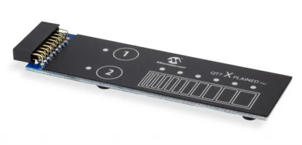

.. _qt7_add_on_shield:

Microchip QT7 Add-on Board
###########################

Overview
********
The Microchip QT7 Xplained Pro kit is an extension board that enables the evaluation of self-capacitance
touch using the Peripheral Touch Controller (PTC) module. The kit shows the moisture performance of
capacitive touch using the PTC Driven shield. The kit includes one board with a QTouch® technology self
capacitance slider, and two QTouch technology self-capacitance buttons. It also has 8 LEDs, one each for
corresponding buttons and slider positions.

More information about the shield can be found at `QT7 Xplained Pro User Guide`_.

Programming
***********

Activate the presence of the shield for the project build by adding the
``--shield qt7_<board_name>`` when you invoke ``west build``

.. zephyr-app-commands::
   :app: samples/shields/mchp_QT7
   :board: your_board_name
   :shield: qt7_<board_name>
   :goals: build

example:

.. code-block:: console

   west build -p always -b pic32cm_jh01_cpro samples\shields\mchp_QT7 --shield qt7_pic32cm_jh01_cpro

References
**********

.. target-notes::

.. _QT7 Xplained Pro User Guide:
   https://ww1.microchip.com/downloads/aemDocuments/documents/OTH/ProductDocuments/UserGuides/QT7XplainedProUserGuide50002725A.pdf
