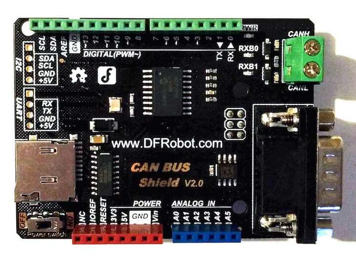
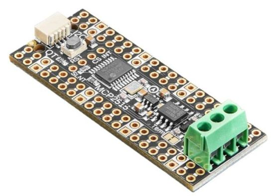

.. _mcp2515_shield:

Microchip MCP2515 CAN bus shields
#################################

Zephyr supports a couple of different shields carrying the Microchip `MCP2515`_
Stand-Alone CAN Controller with SPI Interface.

DFRobot CAN BUS Shield V2.0
***************************

Overview
--------

The DFRobot CAN BUS shield supports the Microchip MCP2515 stand-alone CAN
controller and JTA1050 high speed CAN transceiver. The shield has an Arduino
Uno R3 compatible hardware interface.

Hardware
--------

- MCP2515

        - Stand-Alone CAN 2.0B Controller
        - Up to 1Mb/s baud rate
        - Standard and extended data and remote frames
        - 3x Tx Buffers
        - 2x Rx Buffers
        - 6x 29-bit Filters
        - 2x 29-bit Masks
        - Interrupt output
        - One shot mode
        - High speed SPI interface (10 MHz)

- TJA1050

        - Fully compatible with the “ISO 11898” standard
        - High speed (up to 1 Mbaud)

- Connectivity

        - Industrial standard DB9 terminal (CAN)
        - Screw terminals (CAN)
        - Integrated MicroSD socket for data storage (SPI)
        - Arduino Uno R3 compatible (SPI)

+-------+-----------------------+---------------------------+
| Name  | Function              | Usage                     |
+=======+=======================+===========================+
| A0    | None                  |                           |
+-------+-----------------------+---------------------------+
| A1    | None                  |                           |
+-------+-----------------------+---------------------------+
| A2    | None                  |                           |
+-------+-----------------------+---------------------------+
| A3    | None                  |                           |
+-------+-----------------------+---------------------------+
| A4    | None                  |                           |
+-------+-----------------------+---------------------------+
| A5    | None                  |                           |
+-------+-----------------------+---------------------------+
| D0    | RX                    | Ext. header only          |
+-------+-----------------------+---------------------------+
| D1    | TX                    | Ext. header only          |
+-------+-----------------------+---------------------------+
| D2    | GPIO_ACTIVE_LOW       | MCP2515 - INT             |
+-------+-----------------------+---------------------------+
| D3    | None                  |                           |
+-------+-----------------------+---------------------------+
| D4    | SPI-CS                | MicroSD                   |
+-------+-----------------------+---------------------------+
| D5    | None                  |                           |
+-------+-----------------------+---------------------------+
| D6    | None                  |                           |
+-------+-----------------------+---------------------------+
| D7    | None                  |                           |
+-------+-----------------------+---------------------------+
| D8    | None                  |                           |
+-------+-----------------------+---------------------------+
| D9    | None                  |                           |
+-------+-----------------------+---------------------------+
| D10   | SPI-CS                | MCP2515                   |
+-------+-----------------------+---------------------------+
| D11   | SPI-MOSI              | MCP2515 / MicroSD         |
+-------+-----------------------+---------------------------+
| D12   | SPI-MISO              | MCP2515 / MicroSD         |
+-------+-----------------------+---------------------------+
| D13   | SPI-CLK               | MCP2515 / MicroSD         |
+-------+-----------------------+---------------------------+
| D14   | I2C-SDA               | Ext. header only          |
+-------+-----------------------+---------------------------+
| D15   | I2C_SCL               | Ext. header only          |
+-------+-----------------------+---------------------------+

- Power Supply

        - 3.3V ~ 5V

- Components

        - Power switch
        - Power LED
        - RX0BF LED
        - RX1BF LED

For more information about the DFRobot CAN-BUS V2.0 shield:

- `DFRobot Website`_
- `DFRobot CAN BUS Shield V2.0 schematic`_
- `MCP2515 Datasheet`_
- `TJA1050 Datasheet`_

Keyestudio CAN-BUS Shield (KS0411)
**********************************

Overview
--------

The Keyestudio CAN BUS shield supports the Microchip MCP2515 stand-alone CAN
controller and MCP2551 high speed CAN transceiver. The shield has an Arduino
Uno R3 compatible hardware interface.

.. figure:: keyestudio_can_bus_ks0411.jpg
   :align: center
   :alt: Keyestudio CAN-BUS Shield (KS0411)

   Keyestudio CAN-BUS Shield (KS0411) (Credit: Keyestudio)

Hardware
--------

- MCP2515

        - Stand-Alone CAN 2.0B Controller
        - Up to 1Mb/s baud rate
        - Standard and extended data and remote frames
        - 3x Tx Buffers
        - 2x Rx Buffers
        - 6x 29-bit Filters
        - 2x 29-bit Masks
        - Interrupt output
        - One shot mode
        - High speed SPI interface (10 MHz)

- MCP2551

        - Fully compatible with the “ISO 11898” standard
        - High speed (up to 1 Mbaud)

- Connectivity

        - Industrial standard DB9 terminal (CAN)
        - Pin headers (CAN)
        - Integrated MicroSD socket for data storage (SPI)
        - Arduino Uno R3 compatible (SPI)

+-------+-----------------------+---------------------------+
| Name  | Function              | Usage                     |
+=======+=======================+===========================+
| A0    | None                  |                           |
+-------+-----------------------+---------------------------+
| A1    | None                  |                           |
+-------+-----------------------+---------------------------+
| A2    | None                  |                           |
+-------+-----------------------+---------------------------+
| A3    | None                  |                           |
+-------+-----------------------+---------------------------+
| A4    | None                  |                           |
+-------+-----------------------+---------------------------+
| A5    | None                  |                           |
+-------+-----------------------+---------------------------+
| D0    | RX                    | Ext. header only          |
+-------+-----------------------+---------------------------+
| D1    | TX                    | Ext. header only          |
+-------+-----------------------+---------------------------+
| D2    | None                  |                           |
+-------+-----------------------+---------------------------+
| D3    | None                  |                           |
+-------+-----------------------+---------------------------+
| D4    | None                  |                           |
+-------+-----------------------+---------------------------+
| D5    | None                  |                           |
+-------+-----------------------+---------------------------+
| D6    | None                  |                           |
+-------+-----------------------+---------------------------+
| D7    | None                  |                           |
+-------+-----------------------+---------------------------+
| D8    | GPIO_ACTIVE_LOW       | MCP2515 - INT             |
+-------+-----------------------+---------------------------+
| D9    | SPI-CS                | MicroSD                   |
+-------+-----------------------+---------------------------+
| D10   | SPI-CS                | MCP2515                   |
+-------+-----------------------+---------------------------+
| D11   | SPI-MOSI              | MCP2515 / MicroSD         |
+-------+-----------------------+---------------------------+
| D12   | SPI-MISO              | MCP2515 / MicroSD         |
+-------+-----------------------+---------------------------+
| D13   | SPI-CLK               | MCP2515 / MicroSD         |
+-------+-----------------------+---------------------------+
| D14   | I2C-SDA               | Ext. header only          |
+-------+-----------------------+---------------------------+
| D15   | I2C_SCL               | Ext. header only          |
+-------+-----------------------+---------------------------+

- Power Supply

        - 5.0VDC

For more information about the Keyestudio CAN-BUS shield:

- `Keyestudio Website`_
- `Keyestudio Wiki`_
- `MCP2515 Datasheet`_
- `MCP2551 Datasheet`_

Adafruit PiCowbell CAN Bus Shield for Pico
******************************************

Overview
--------

The Adafruit PiCowbell CAN Bus Shield uses the Microchip MCP2515 controller
with an TJA1051/3 transceiver. This shield is built for the Raspberry Pi Pico
and uses the SPI interface. It also contains a Qwiic connector to add support
for a sensor.

   Adafruit PiCowbell CAN Bus Shield

Hardware
--------

- MCP2515

        - Stand-Alone CAN 2.0B Controller
        - Up to 1Mb/s baud rate
        - Standard and extended data and remote frames
        - 3x Tx Buffers
        - 2x Rx Buffers
        - 6x 29-bit Filters
        - 2x 29-bit Masks
        - Interrupt output
        - One shot mode
        - High speed SPI interface (10 MHz)

- TJA1051

        - Fully compatible with the “ISO 11898-2:2016”, "SAE J2284-1" & "SAE J2284-5"  standards
        - Supports CAN FD
        - Fast data rates (up to 5 Mbit/s)

- Connectivity

        - Terminal Block - 3-pin 3.5mm (CAN)
        - Raspberry Pi Pico compatible (SPI)

+-------+-----------------------+---------------------------+
| Name  | Function              | Usage                     |
+=======+=======================+===========================+
| GP0   | None                  |                           |
+-------+-----------------------+---------------------------+
| GP1   | None                  |                           |
+-------+-----------------------+---------------------------+
| GP2   | None                  |                           |
+-------+-----------------------+---------------------------+
| GP3   | None                  |                           |
+-------+-----------------------+---------------------------+
| GP4   | None                  |                           |
+-------+-----------------------+---------------------------+
| GP5   | None                  |                           |
+-------+-----------------------+---------------------------+
| GP6   | None                  |                           |
+-------+-----------------------+---------------------------+
| GP7   | None                  |                           |
+-------+-----------------------+---------------------------+
| GP8   | None                  |                           |
+-------+-----------------------+---------------------------+
| GP9   | None                  |                           |
+-------+-----------------------+---------------------------+
| GP10  | None                  |                           |
+-------+-----------------------+---------------------------+
| GP11  | None                  |                           |
+-------+-----------------------+---------------------------+
| GP12  | None                  |                           |
+-------+-----------------------+---------------------------+
| GP13  | None                  |                           |
+-------+-----------------------+---------------------------+
| GP14  | None                  |                           |
+-------+-----------------------+---------------------------+
| GP15  | None                  |                           |
+-------+-----------------------+---------------------------+
| GP16  | SPI-MISO              | MCP2515                   |
+-------+-----------------------+---------------------------+
| GP17  | None                  |                           |
+-------+-----------------------+---------------------------+
| GP18  | SPI-SCK               | MCP2515                   |
+-------+-----------------------+---------------------------+
| GP19  | SPI-MOSI              | MCP2515                   |
+-------+-----------------------+---------------------------+
| GP20  | SPI-CS                | MCP2515                   |
+-------+-----------------------+---------------------------+
| GP21  | GPIO_ACTIVE_LOW       | MCP2515 - INT             |
+-------+-----------------------+---------------------------+
| GP22  | None                  |                           |
+-------+-----------------------+---------------------------+
| GP23  | None                  |                           |
+-------+-----------------------+---------------------------+
| GP24  | None                  |                           |
+-------+-----------------------+---------------------------+
| GP25  | None                  |                           |
+-------+-----------------------+---------------------------+
| GP26  | None                  |                           |
+-------+-----------------------+---------------------------+
| GP27  | None                  |                           |
+-------+-----------------------+---------------------------+
| GP28  | None                  |                           |
+-------+-----------------------+---------------------------+

- Power Supply

        - 3.3V ~ 5V

For more information about the Adafruit PiCowbell CAN Bus shield:

- `Adafruit Website`_
- `MCP2515 Datasheet`_
- `TJA1051 Datasheet`_

Programming
***********

Set ``-DSHIELD=dfrobot_can_bus_v2_0`` or ``-DSHIELD=keyestudio_can_bus_ks0411``
or ``-DSHIELD=adafruit_can_picowbell`` when you invoke ``west build`` or ``cmake`` in your Zephyr application. For
example:

.. zephyr-app-commands::
   :zephyr-app: samples/drivers/can/counter
   :tool: all
   :board: nrf52dk_nrf52832
   :shield: dfrobot_can_bus_v2_0
   :goals: build flash

.. zephyr-app-commands::
   :zephyr-app: samples/drivers/can/counter
   :tool: all
   :board: nrf52840dk_nrf52840
   :shield: keyestudio_can_bus_ks0411
   :goals: build flash

.. zephyr-app-commands::
   :zephyr-app: samples/drivers/can/counter
   :tool: all
   :board: rpi_pico
   :shield: adafruit_can_picowbell
   :goals: build

.. _DFRobot Website:
   https://www.dfrobot.com/product-1444.html

.. _DFRobot CAN BUS Shield V2.0 schematic:
   https://github.com/DFRobot/DFRobot_MCP2515/blob/master/resources/doc/DFR0370%20CAN%20BUS%20sheild(V2.0).pdf

.. _MCP2515:
   https://www.microchip.com/en-us/product/MCP2515

.. _Keyestudio Website:
   https://www.keyestudio.com/products/2019new-keyestudio-can-bus-shield-mcp2551-chip-with-sd-socket-for-arduino-uno-r3

.. _Keyestudio Wiki:
   https://wiki.keyestudio.com/KS0411_keyestudio_CAN-BUS_Shield

.. _MCP2515 Datasheet:
   http://ww1.microchip.com/downloads/en/DeviceDoc/MCP2515-Stand-Alone-CAN-Controller-with-SPI-20001801J.pdf

.. _TJA1050 Datasheet:
   https://www.nxp.com/docs/en/data-sheet/TJA1050.pdf

.. _MCP2551 Datasheet:
   https://ww1.microchip.com/downloads/en/DeviceDoc/20001667G.pdf

.. _Adafruit Website:
   https://www.adafruit.com/product/5728#technical-details

.. _TJA1051 Datasheet:
   https://www.nxp.com/docs/en/data-sheet/TJA1051.pdf
