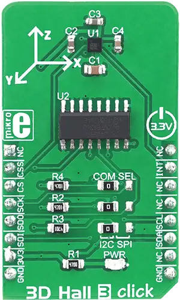

.. _mikroe_3d_hall_3_click_shield:

MikroElektronika 3D Hall 3 Click
================================

Overview
********

`3D Hall 3 Click`_ is a very accurate, magnetic field sensing Click board™, used to measure the
intensity of the magnetic field across three perpendicular axes.

It is equipped with the LIS2MDL, a low power 3D magnetic sensor. This IC has a separate Hall sensing
element on each axis, which allows a very accurate and reliable measurement of the magnetic field
intensity in a 3D space, offering a basis for accurate positional calculations. Both I2C and SPI
communication protocols are supported by the LIS2MDL. This sensor IC features a powerful
programmable interrupt engine, allowing firmware optimization.

   3D Hall 3 Click

Requirements
************

This shield can only be used with a board that provides a mikroBUS |trade| socket and defines a
``mikrobus_i2c`` node label for the mikroBUS™ I2C interface. See :ref:`shields` for more details.

Programming
***********

Set ``-DSHIELD=mikroe_3d_hall_3_click`` when you invoke ``west build``. For example:

.. zephyr-app-commands::
   :zephyr-app: samples/sensor/magn_polling
   :board: mikroe_clicker_ra4m1/r7fa4m1ab3cfm
   :shield: mikroe_3d_hall_3_click
   :goals: build

See :dtcompatible:`st,lis2mdl` for documentation on the additional binding properties available for
the LIS2MDL sensor.

References
**********

- `3D Hall 3 Click`_
- `3D Hall 3 Click schematic`_

.. _3D Hall 3 Click: https://www.mikroe.com/3d-hall-3-click
.. _3D Hall 3 Click schematic: https://download.mikroe.com/documents/add-on-boards/click/3d-hall-3/3d-hall-3-click-schematic-v100.pdf
