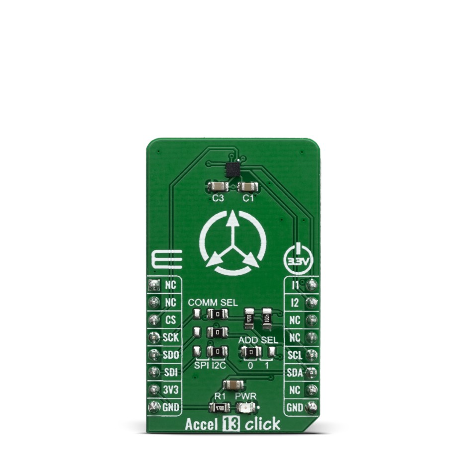

.. _mikroe_accel13_click_shield:

MikroElektronika ACCEL 13 Click
###############################

Overview
********

The MikroElektronika ACCEL 13 Click carries the `IIS2DLPC`_ ultra-low
power triaxial accelerometer sensor in a `mikroBUS`_ |trade| form factor.

The `IIS2DLPC`_ sensor supports both SPI and I2C bus protocols. Currently
only I2C is supported for this shield.

   MikroElektronika ACCEL 13 Click (Credit: MikroElektronika)

Requirements
************

This shield can only be used with a development board that provides a
configuration for mikroBUS connectors and defines a node alias for the mikroBUS
I2C interface (see :ref:`shields` for more details).

For more information about interfacing the IIS2DLPC and the ACCEL 13 Click,
see the following documentation:

- `IIS2DLPC Datasheet`_
- `ACCEL 13 Click`_

Programming
***********

Set ``--shield mikro_accel13_click`` when you invoke ``west build``. For
example:

.. zephyr-app-commands::
   :zephyr-app: test/boards/board_shell
   :board: lpcxpresso55s69
   :shield: mikroe_accel13_click
   :goals: build

.. _IIS2DLPC:
   https://www.st.com/en/mems-and-sensors/iis2dlpc.html

.. _mikroBUS:
   https://www.mikroe.com/mikrobus

.. _IIS2DLPC Datasheet:
   https://www.st.com/resource/en/datasheet/iis2dlpc.pdf

.. _ACCEL 13 Click:
   https://www.mikroe.com/accel-13-click
