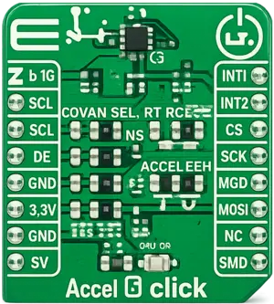

.. _mikroe_accel4_click_shield:

MikroElektronika 3 axis Accel 4 Click
=====================================

Overview
********

`Accel 4 Click`_ is a sensing Click board™, equipped with the FXLS8974CF, a 3 axis accelerometer sensor.

This IC has a separate sensing element on each axis, which allows a very accurate and reliable measurement
of the acceleration intensity in a 3D space, offering a basis for accurate positional calculations.
Both I2C and SPI communication protocols are supported by the FXLS8974CF. This sensor IC features a powerful
programmable interrupt engine, allowing firmware optimization.

   Accel 4 Click

Requirements
************

This shield can only be used with a board that provides a mikroBUS™ socket and defines a
``mikrobus_i2c`` node label for the mikroBUS™ I2C interface. See :ref:`shields` for more details.

Programming
***********

Set ``--shield mikroe_accel4_click`` when you invoke ``west build``. For example:

.. zephyr-app-commands::
   :zephyr-app: samples/sensor/accel_polling
   :board: frdm_mcxn947/mcxn947/cpu0
   :shield: mikroe_accel4_click
   :goals: build flash

See :dtcompatible:`nxp,fxls8974` for documentation on the additional binding properties available for
the FXLS8974CF sensor.

References
**********

- `Accel 4 Click`_
- `Accel 4 Click schematic`_

.. _Accel 4 Click: https://www.mikroe.com/accel-4-click
.. _Accel 4 Click schematic: https://download.mikroe.com/documents/add-on-boards/click/accel_4_click/Accel_4_click_v100_Schematic.PDF
