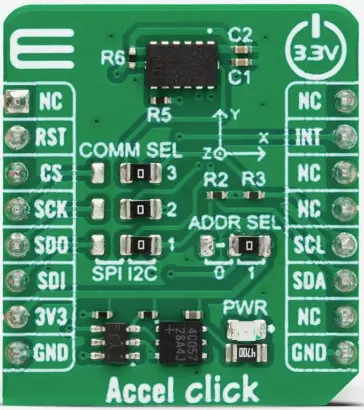

.. _mikroe_accel_click_shield:

MikroElektronika ACCEL Click
############################

Overview
********

The MikroElektronika ACCEL Click carries the `ADXL345`_ ultra-low
power 3-axis accelerometer sensor in a `mikroBUS`_ |trade| form factor.

The `ADXL345`_ sensor supports both SPI and I2C bus protocols. Currently
only I2C is supported for this shield.

   MikroElektronika ACCEL Click (Credit: MikroElektronika)

Requirements
************

This shield can only be used with a development board that defines a node alias
for the mikroBUS I2C interface (see :ref:`shields` for more details).

For more information about interfacing to the ADXL345 and the ACCEL Click, see
the following documentation:

- `ADXL345 Datasheet`_
- `ACCEL Click`_

Programming
***********

Set ``--shield mikroe_accel_click`` when you invoke ``west build``. For
example:

.. zephyr-app-commands::
   :zephyr-app: samples/sensor/accel_polling
   :board: lpcxpresso55s16
   :shield: mikroe_accel_click
   :goals: build

References
**********

.. target-notes::

.. _ADXL345:
   https://www.analog.com/en/products/adxl345.html

.. _mikroBUS:
   https://www.mikroe.com/mikrobus

.. _ADXL345 Datasheet:
   https://www.analog.com/media/en/technical-documentation/data-sheets/adxl345.pdf

.. _ACCEL Click:
   https://www.mikroe.com/accel-click
