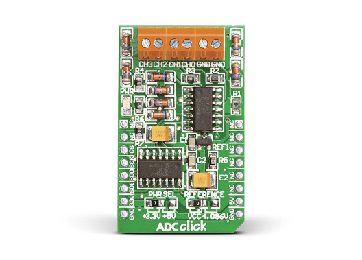

.. _mikroe_adc_click_shield:

MikroElektronika ADC Click
##########################

Overview
********

The MikroElektronika ADC Click carries the `MCP3204`_ 12-bit
Analog-to-Digital converter in a `mikroBUS`_ |trade| form factor.

   MikroElektronika ADC Click (Credit: MikroElektronika)

Requirements
************

This shield can only be used with a development board that provides a
configuration for mikroBUS connectors and defines a node alias for the mikroBUS
SPI interface (see :ref:`shields` for more details).

For more information about interfacing the MCP3204 and the ADC Click,
see the following documentation:

- `MCP3204 Datasheet`_
- `ADC Click`_

Programming
***********

Set ``--shield mikro_adc_click`` when you invoke ``west build``. For
example:

.. zephyr-app-commands::
   :app: <my_app>
   :board: lpcxpresso55s16
   :shield: mikroe_adc_click
   :goals: build

.. _MCP3204:
   https://www.microchip.com/wwwproducts/en/en010533

.. _mikroBUS:
   https://www.mikroe.com/mikrobus

.. _MCP3204 Datasheet:
   http://ww1.microchip.com/downloads/en/DeviceDoc/21298e.pdf

.. _ADC Click:
   https://www.mikroe.com/adc-click
