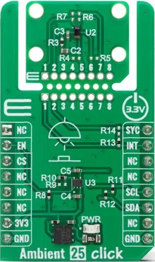

.. _mikroe_ambient_25_click_shield:

MikroElektronika Ambient 25 Click
=================================

Overview
********

`Ambient 25 Click`_ is a compact add-on board that provides highly sensitive ambient light sensing
with advanced light flicker detection.

It is based on the TSL2522, an ambient light sensor from ams OSRAM that integrates both photopic
and infrared photodiodes with peak wavelengths of 560nm and 880nm. The sensor supports dual
concurrent light sensing channels, invisible ALS operation under any glass type, programmable gain
and integration time, and a wide 4096x dynamic range, with detection capabilities down to 1mlux.
Ambient 25 Click also features a light flicker detection engine, I2C interface with interrupt
support, a dual-purpose SYC pin for synchronization or GPIO functionality, and the unique Click
Snap format that allows the sensor section to be detached and used independently.
This Click board™ is perfectly suited for indoor and outdoor brightness measurement, display
brightness management, and camera assistance applications.

   Ambient 25 Click

Requirements
************

This shield can only be used with a board that provides a mikroBUS™ socket and defines a
``mikrobus_i2c`` node label for the mikroBUS™ I2C interface. See :ref:`shields` for more
details.

Programming
***********

Set ``-DSHIELD=mikroe_ambient_25_click`` when you invoke ``west build``. For example:

.. zephyr-app-commands::
   :zephyr-app: samples/sensor/light_polling
   :board: frdm_mcxn947/mcxn947/cpu0
   :shield: mikroe_ambient_25_click
   :goals: build

References
**********

- `Ambient 25 Click`_

.. _Ambient 25 Click: https://www.mikroe.com/ambient-25-click
