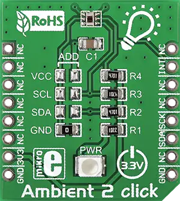

.. _mikroe_ambient_2_click_shield:

MikroElektronika Ambient 2 Click
================================

Overview
********

`Ambient 2 Click`_ is a compact add-on board that measures only the visible part of the light
spectrum from any source (mimicking how humans see the light).

This board features the OPT3001, a digital output ambient light sensor with an I2C interface and
interrupt from Texas Instruments. The sensor's spectral response tightly matches the human eye's
photopic response and includes significant (99%) infrared rejection. It has a flexible and wide
operating range for the ambient light sensor with a resolution of 0.01lux and full detectable
illumination of 83865.6lux over a 23-bit effective dynamic range. This Click board |trade| is the
most suitable for obtaining ambient light data in applications such as automatic residential and
commercial lighting management.

   Ambient 2 Click

Requirements
************

This shield can only be used with a board that provides a mikroBUS |trade| socket and defines a
``mikrobus_i2c`` node label for the mikroBUS |trade| I2C interfac e. See :ref:`shields` for more
details.

Programming
***********

Set ``-DSHIELD=mikroe_ambient_2_click`` when you invoke ``west build``. For example:

.. zephyr-app-commands::
   :zephyr-app: samples/sensor/light_polling
   :board: mikroe_clicker_ra4m1
   :shield: mikroe_ambient_2_click
   :goals: build

References
**********

- `Ambient 2 Click`_

.. _Ambient 2 Click: https://www.mikroe.com/ambient-2-click
