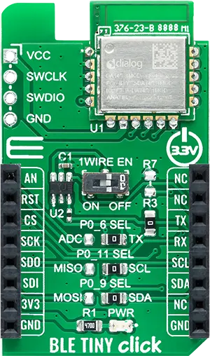
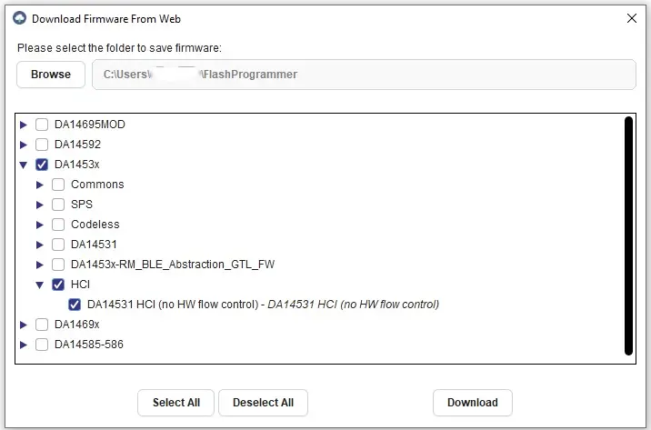

.. _mikroe_ble_tiny_click_shield:

MikroElektronika BLE TINY Click
###############################

Overview
********

The MikroElektronika BLE TINY Click carries the Renesas `DA14531MOD`_ Bluetooth
LE module in a `mikroBUS`_ |trade| form factor.

   MikroElektronika BLE TINY Click (Credit: MikroElektronika)

Requirements
************

This shield can only be used with a board that provides a mikroBUS |trade|
socket and defines the ``mikrobus_serial`` node label (see :ref:`shields`
for more details).

.. note::

   The reset input on the DA14531 Module is active high and is connected to
   the RST pin on the mikroBUS socket. On many host boards this RST pin is
   connected to a system reset signal that is active low. This results in the
   host system unintentionally holding the DA14531 Module in reset. This issue
   can be overcome by removing resistor R3 on the BLE TINY Click board, see
   the `BLE TINY Click Schematic`_ for further details.

The DA14531 Module contained on the shield must be programmed with a binary
file that supports the HCI interface over UART, without hardware flow control
as these signals are not supported on the Click footprint.

The `Renesas SmartBond Flash Programmer`_ tool can be used to download a
suitable binary and then program it into the DA14531 via the SWD header
present on the Click board. Once the tool has been installed, open it and
press the "Search Online" button. The required binary file can be selected
for download as follows:

   Selecting the DA14531 HCI Binary File for Download

Press the "Program" button to program the binary file into the DA14531 Module.

For more information about interfacing to the DA14531 and the BLE TINY Click,
see the following documentation:

- `DA14531MOD Datasheet`_
- `BLE TINY Click`_

Programming
***********

Set ``--shield mikroe_ble_tiny_click`` when you invoke ``west build``. For
example:

.. zephyr-app-commands::
   :zephyr-app: samples/bluetooth/beacon
   :board: ek-ra8m1
   :shield: mikroe_ble_tiny_click
   :goals: build

References
**********

.. target-notes::

.. _DA14531MOD:
   https://www.renesas.com/us/en/products/wireless-connectivity/bluetooth-low-energy/da14531mod-smartbond-tiny-bluetooth-low-energy-module

.. _mikroBUS:
   https://www.mikroe.com/mikrobus

.. _DA14531MOD Datasheet:
   https://www.renesas.com/us/en/document/dst/da14531-module-datasheet?r=1601921

.. _BLE TINY Click:
   https://www.mikroe.com/ble-tiny-click

.. _BLE TINY Click Schematic:
   https://download.mikroe.com/documents/add-on-boards/click/ble_tiny_click/BLE_TINY_click_v102_Schematic.pdf

.. _Renesas SmartBond Flash Programmer:
   https://www.renesas.com/us/en/software-tool/smartbond-flash-programmer
