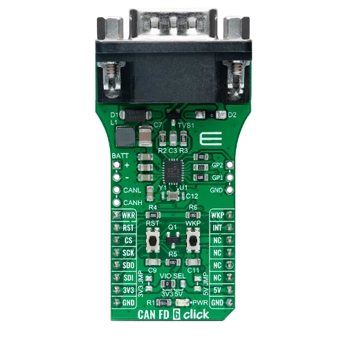

.. _mikroe_can_fd_6_click_shield:

MikroElektronika CAN FD 6 Click
###############################

Overview
--------

The CAN FD 6 Click shield has a `TI TCAN4550-Q1`_ automotive system
basis chip (SBC) with integrated CAN FD controller via a SPI interface
and a integrated high-speed CAN FD transceiver with up to 5 Mbps.

More information about the shield can be found at
`Mikroe CAN FD 6 click`_.

   MikroElektronika CAN FD 6 Click (Credit: MikroElektronika)

Requirements
************

The shield uses a mikroBUS interface. The target board must define the
``mikrobus_spi`` and ``mikrobus_header`` node labels (see :ref:`shields`
for more details). The target board must also support level triggered
interrupts and SPI clock frequency of up to 18 MHz.

Programming
***********

Set ``--shield mikroe_can_fd_6_click`` when you invoke ``west build``,
for example:

.. zephyr-app-commands::
   :zephyr-app: samples/drivers/can/counter
   :board: mikroe_stm32_m4_clicker
   :shield: mikroe_can_fd_6_click
   :goals: build flash

References
**********

.. target-notes::

.. _Mikroe CAN FD 6 click:
   https://www.mikroe.com/can-fd-6-click

.. _TI TCAN4550-Q1:
   https://www.ti.com/product/TCAN4550-Q1
