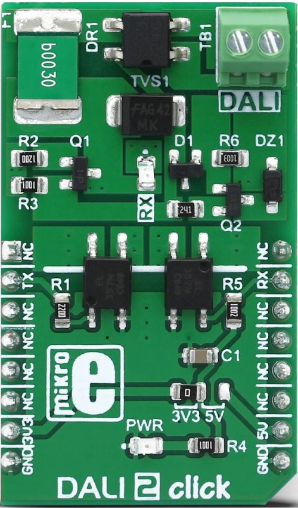

.. _mikroe_dali2_click_shield:

MikroElektronika DALI2 Click
==================================

Overview
********

`DALI2 Click`_ is a compact add-on board that brings a DALI2 PHY interface to control professinal lighting devices.

   DALI2 Click

Requirements
************

This shield can only be used with a board that provides a mikroBUS |trade| socket and defines a
``mikrobus_dali`` node label for the mikroBUS |trade| DALI interface. See :ref:`shields` for more
details.

Programming
***********

Set ``-DSHIELD=mikroe_dali2_click`` when you invoke ``west build``. For example:

.. zephyr-app-commands::
   :zephyr-app: samples/drivers/dali
   :board: nrf52840dk/nrf52840
   :shield: mikroe_dali2_click
   :goals: build

The shield can be added to Arduino headers using an Arduino Uno Click shield (see arduino_uno_click_).

See :dtcompatible:`zephyr,dali-pwm` for documentation on the additional binding properties available for
the DALI.

References
**********

- `DALI2 Click`_

.. _DALI2 Click: https://www.mikroe.com/dali-2-click
