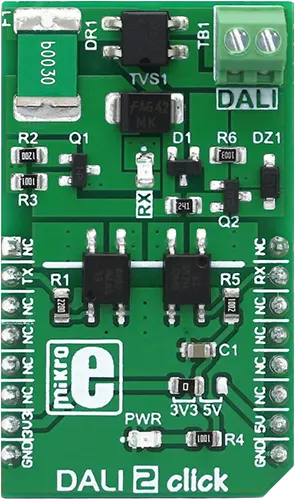

.. _mikroe_dali_2_click_shield:

MikroElektronika DALI 2 Click
#############################

Overview
********

The DALI 2 Click shield provides a physical interface to a DALI bus.
The DALI bus interface uses separate Rx and Tx signals to communicate with the DALI bus.
The board uses optocouplers to isolate the DALI bus from the host board.

More information about the shield can be found at
`Mikroe DALI 2 click`_.

   MikroElektronika DALI 2 Click

Requirements
************

The shield uses a mikroBUS interface.
The target board must define ``mikrobus_header`` node labels
(see :ref:`shields` for more details).

The DALI driver needs a counter and a PWM of the target board, and its timing depends on the
controller in use. The shield therefore provides board specific overlays in
:zephyr_file:`boards/shields/mikroe_dali_2_click/boards` that select the counter and PWM and set
the ``tx-prog-delay-us`` property. The timing properties that depend on the click board only are
set in :zephyr_file:`boards/shields/mikroe_dali_2_click/mikroe_dali_2_click.overlay`.

The following boards are supported, using the :ref:`arduino_uno_click` shield as adapter:

- :zephyr:board:`nrf52840dk`
- :zephyr:board:`nucleo_f091rc`

For other boards, add a board overlay to the shield or to your application.

Programming
***********

Set ``--shield mikroe_dali_2_click`` when you invoke ``west build``. For example:

.. zephyr-app-commands::
   :zephyr-app: samples/drivers/dali/blinky
   :board: <board>
   :shield: arduino_uno_click,mikroe_dali_2_click
   :goals: build flash

References
**********

.. target-notes::

.. _Mikroe DALI 2 click:
   https://www.mikroe.com/dali-2-click
